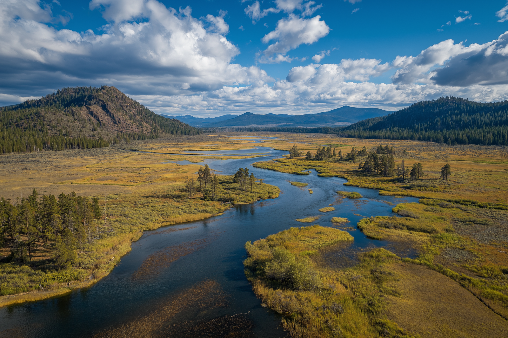

# The Aursen Marshes

-    :octicons-location-24:{ .lg .middle } A marsh in the [Refounded Alliance of Aurbez](<./refounded-alliance-of-aurbez.md>), the [Upper Istaros](<../upper-istaros.md>)  
    :octicons-location-24:{ .lg .middle } Located on the [Aursen](<../../major-rivers/istaros-watershed/aursen.md>), in the [Istaros Watershed](<../../major-rivers/istaros-watershed/istaros-watershed.md>)  

The Aursen Marshes are a marshy area of the [Aursen River](<../../major-rivers/istaros-watershed/aursen.md>), predominantly occupying a basin and depression near the edge of the [Aurbez Plateau](<../aurbez-plateau.md>) escarpment. The marshes themselves are largely inhabited by [lizardfolk](<../../../species/lizardfolk.md>) and the occasional homesteader who does not mind the flooding the spring snowmelt brings. The area itself is a productive agricultural region and the edges of the marshes are intensively farmed by the people of the [Refounded Alliance of Aurbez](<./refounded-alliance-of-aurbez.md>). 

