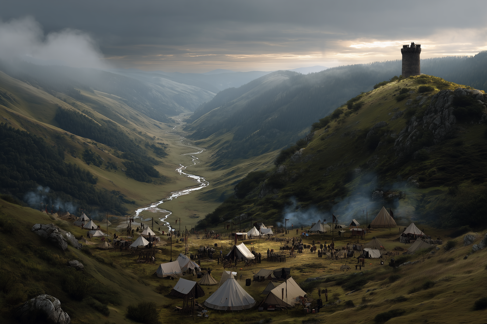

# Three Wells

-    :octicons-location-24:{ .lg .middle } A meeting place in the [Refounded Alliance of Aurbez](<./refounded-alliance-of-aurbez.md>), [Upper Istaros](<../upper-istaros.md>)  
    :octicons-location-24:{ .lg .middle } Located in the [Aurbez Plateau](<../aurbez-plateau.md>), the [Aurbez and the Andonne](<../aurbez-and-the-andonne.md>), the [Istaros Watershed](<../../major-rivers/istaros-watershed/istaros-watershed.md>)  

Three Wells is a meeting place and fortified camp on the [Aurbez Plateau](<../aurbez-plateau.md>), along a small tributary of the [Aursen](<../../major-rivers/istaros-watershed/aursen.md>). For many years, Three Wells has been a place where the people of the [Refounded Alliance of Aurbez](<./refounded-alliance-of-aurbez.md>) meet to debate politics and war. 

At the valley’s heart sit three old stone wells in a tight triangle; between them, a pillar holds a communal bowl of clear water and a ladle. Above the valley, a watchtower is maintained by [The Rangers](<../../../groups/the-rangers.md>)

*Three Wells occupied by Aurbeze gathering to discuss the invasion of the Iron Fang hobgoblins*

Three Wells gets its name, and significance, from the Three Kin's War, when lizardfolk, human, and stoneborn fought together against hobgoblin invaders and worse. The three wells honor each of the three kin who fought in the war. 