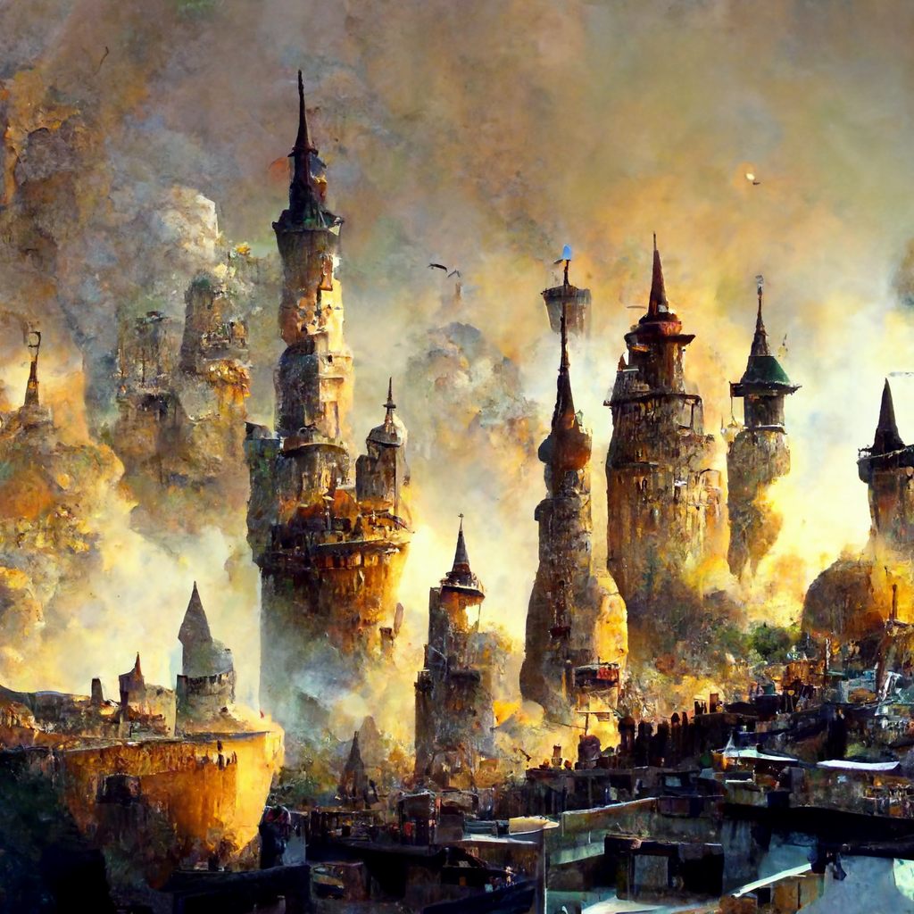

# Chardon

-    :octicons-location-24:{ .lg .middle }   

Chardon is a city of many things. It is the capitol and seat of government of the [Chardonian Empire](<../chardonian-empire.md>). It is a major center of learning and magic. It is a trade hub and economic powerhouse.

Growing from a small settlement on the banks of the Chasa river to an outpost of the Dranokrian Empire, to a powerful city state, and finally the capitol of a vast empire, Chardon has a 2000-year history and many layers.

Like Drankor before it, Chardon is a city full of associations, scholarly societies, and clubs, some more secret than others. Most famous is the Great Library, but many others exist in the city.

## Description

As the coastal fog lifts, the first thing you see is the great black bulk of Mt. Nera looming over the city to the north, the occasional glint of light highlighting the obsidian flows that dot the distant slopes of this long extinct volcano. Mt. Nera gradually slopes to the Chase river, which spreads into a wide estuary and fertile floodplain towards the coast.

The bustle of the port dominates the soundscape of the city - the cries of sailors, the crack and snap of rigging and sails being set, the creak of ships sailing on the morning tide. Beyond the wharves of the port of Chardon, the high walls of the Arsenal protect the entrance to the harbor, and hide the shipbuilding activities of the Chardonian navy from prying eyes.

On the north bank of the river, in the shadow of Mt. Nera, weirs and waterworks are mixed with numerous short, squat buildings of black stone, emitting an acrid stench. These are the chalyte refineries, the source of much of Chardon's wealth, the buildings where the dirty, dangerous, and secret work of turning the raw chalyte ore shipped from the north into precious fuel for the magical works of the city. Few, if anyone, lives by choice amongst the dirt and stench of these refineries, but this doesn't stop the spread of slums along the north bank, filled with those who have no other options, hemmed in by the chaylte works downriver and the walled estates of the rich and powerful upriver.

The vast arch of the River Bridge, its gates and towers marking the division between the slums and the estates, provides the main route across the Chasa. Wide enough for four carts to pass abreast, and enchanted to rise as needed to allow ships to pass, steady foot traffic passes under the watchful eyes of the Praecanti Vigiles - traders, chalyte dealers, wizards and scholars, farmers with goods for market, and many more.

Upriver, the newer Chardon Bridge is used more by locals, farmers as well as the rich and powerful. Smaller, series of twelve arches, this bridge marks the height of navigation for tall-masted sailing ships, although riverboat traffic is frequent here.

The south bank, where the bulk of the city lies, is dominated by the hundreds of towers of Chardon, concentrated in the south and east of the city, where the Great Library stands. But many other sights and spread across the city: the three great markets and dozens of smaller markets, the Imperial Palace, the Cathedral of the Eight, The Pillar of Victory, Haldir's Tomb, the Hospital of the Mother's Grace, as well as other churches, monuments, and palaces scattered across the skyline.

{width="500"}

## Layout

The map drawn by halflings of the [Emerald Song](<../../../../things/ships/emerald-song.md>):

