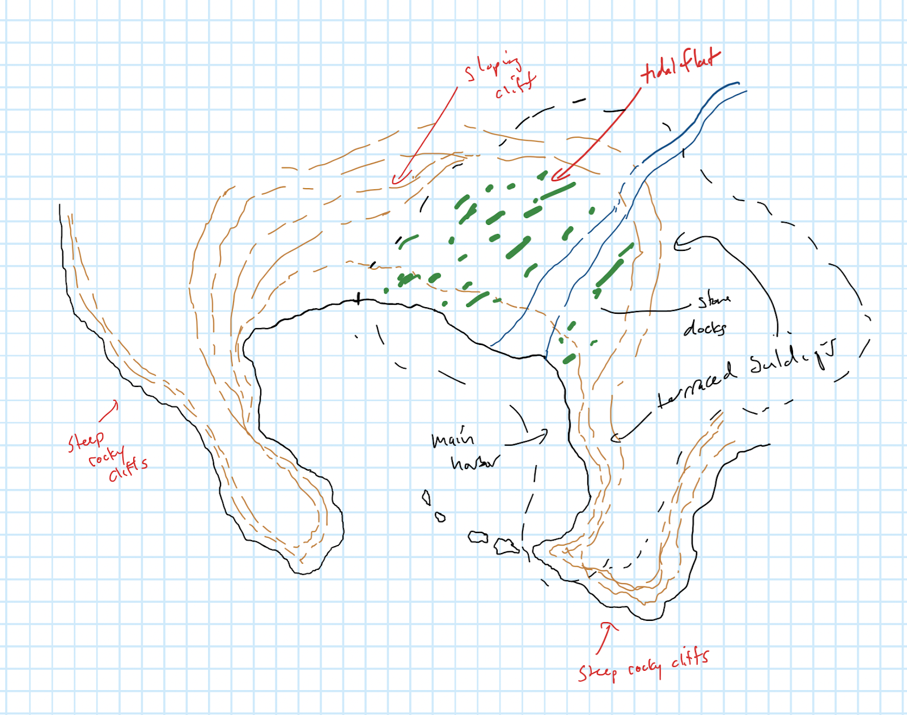

# Hamri

-    :octicons-location-24:{ .lg .middle }   

Hamri is blessed with a sheltered, deep water harbor within a protected bay, and a source of sweet fresh water in the [Mirmir](<../rivers/mirmir.md>) River that cascades from the interior over a series of rapids and waterfalls before emptying into the [Endless Ocean](<../../endless-ocean.md>). These resources have made it prosper, and it is now a major town of 3,500 residents, and one of the economic centers of the western coast of the [Mawakel Peninsula](<./mawakel-peninsula.md>).

## Overview
Hamri is divided into three districts. Much of the town is clustered on stone quays built over the tidal flats of the [Mirmir](<../rivers/mirmir.md>). Known as Low Town, this is the economic powerhouse of Hamri. Warehouses set into the steep cliffs, jumbled houses, inns, and taverns, shipyards and racks full of drying fish mark this bustling district. 

One of the most significant buildings in Low Town is the Leviathan, a huge two-story inn set over the water. Stepping inside, one’s eye is immediately drawn to the massive reconstructed skeleton hanging from the ceiling, a beast much larger than any whale or fish. With three eye sockets, a tail so long it cannot fit even in the massive banquet hall, and a massive jaw that dwarfs a full grown [human](<../../../species/humans/humans.md>), this reconstructed skeleton is one of the most notable features of Hamri.  

Above Low Town, stretching along the steep cliffs, is the Cliffside district, a series of narrow, terraced steps in the sheer cliff face, connected by switchbacks and steep passages. This district houses many of the merchants, ship owners, and wealthier traders of Hamri. Sheltered from the wind and weather, these houses tend to be finer, drier, and warmer than the Low Town, although the steep terrain limits the building space. At best maybe five hundred people are lucky enough to live up here, above the bustle of the Low Town.

Finally, on the windswept tops of the high cliffs are the Towers. Few people live here, as the biting winds make this a dreary home in winter, and the narrow, rocky paths are difficult to navigate in the rains. The most notable feature of the Towers, on both sides of the harbor, are a series of tall seawatch towers, facing the ocean, that serve as watch posts both to spot danger from the ocean and spot wrecks off shore from which people can be saved. The largest tower, maintained by the citizens of Hamri, sits on the western tip of the main cliffs above town, overlooking the Shark’s Teeth, a series of jagged rocks that jut out in a line from the cliffs. But many other towers, some abandoned, some now inhabited by ocean watchers who commune with the waters of the [Endless Ocean](<../../endless-ocean.md>), dot the tops of the cliffs.  

### The Drowned Flats

Nestled on the west side of the [Mirmir](<../rivers/mirmir.md>) River, near the cliffs, the Drowned Flats are the poorest and most wretched district of Hamri. A collection of makeshift shacks built on ramshackle slits and platforms, the Drowned Flats is flooded just about every full month, when the tides are higher than usual. About a hundred down-on-their luck souls eke out a living here amongst the reeds, making do with day-labor, charity, and what they can scavenge from the tidal swamp and the sea. No bridge crosses the [Mirmir](<../rivers/mirmir.md>), and each day for several hours at high tide, the Drowned Flats are cut off from Hamri save by sea. This area is mostly the domain of beggars, the disabled, the gazta-addled, and petty thieves not yet caught. 

### The Fish Market

A large wooden plaza, built on stilts over the mud of the tidal flats, south/east of the [Mirmir](<../rivers/mirmir.md>), this is the central market of Hamri. Each morning and evening it bustles with activity as fisherfolk sell their wares. Auction areas for the choicest cuts dominate the center of the plaza, and many market stalls crowd along the sides selling not only dried cod, and fresh herring, clams and seaweed, but also rarer finds of the sea: pearls, whale oil, carved baleen, and other fineries. The smell and noise are intense during the crowded parts of the morning rush, but by lunch it is the quiet preserve of a handful of town elders who sit around gossiping, playing cards, and drinking walaq, a cheap and in the eyes of many, disgusting, local beer made from seaweed.

By evening, the second rush comes in, and the market is again a bustling place.

### Glittercliff

Near the top of the Cliffside District, set off the main road from the Low District, a wide, flat terrace opens up. This terrace looks like a massive gash in the side of the cliff, torn from the rock as if by some enormous creature or weapon. No one knows how it was made, but it is a perfectly smooth terrace, about 200' by 200', set on the side of the cliff. The ground sparkles -- as if from flecks of quartz embedded in the rock -- and it appears smooth and polished. The surface of the terrace seems undamageable, or at least, in hundreds of years nothing has seemed to scratch it. During the full moon, the sparkles seem to grow brighter, and at times, during especially high tides, they drift through the rock toward the ocean, almost like they are trying to go home.

Built along the front of the terrace is a fountain and small garden. Along the back, are four magnificent houses, said to be the grandest in the town. Of course, the Mawar are an egalitarian people, such as it goes, and these are not palaces or the homes of royalty. But wealth still does buy the finer things in life. The largest of the four houses is the Sayani family mansion. The Sayani’s have long been important leaders of the town, and their house is richly decorated with artifacts dating back to the [Great War](<../../../events/1500s/great-war.md>). One of the houses is the home of Hirshim Anwafi, the head of an important fishing family, and his sister, Yadria, unmarried and openly rumored to be one of the main sources of illicit gatza in Hamri. The third house is the home of [Sulfi Mahadra](<../../../people/mawarans/sulfi-mahadra.md>) and her partner Iesha. Known as the Queen of Ships, Sulfi owns what at times seems like half the fishing fleet in Hamri, and is the most important boat builder in the region. The fourth and smallest house, set at the eastern edge of the terrace where the views over the ocean are most pronounced, is the guildhall of the Society of Ocean Watchers.

### The North Dock

The great docks of Hamri stretch through much of Low Town, from the [Mirmir](<../rivers/mirmir.md>) along much of the edge of the cliffs. At the northern stretch, near the Leviathan, is the busiest spot. The North Dock stretches about 800' feet into the harbor, and is made of sturdy mountain pines. The dock is dotted with several warehouses and drying racks, as well as many tieups for boats. The two most notable buildings on the north dock, however, are Sulfi's Tollhouse and The Stormy Maiden. 

Sulifi's Tollhouse is owned by [Sulfi Mahadra](<../../../people/mawarans/sulfi-mahadra.md>) (see above, under Gilttercliff) and is the guardhouse and rent collection station for the North Dock. Sulfi owns the dock, and charges a small daily or monthly fee for tie ups. The guardhouse is near the front of the dock, and is usually staffed by a handful of guards, who also usually walk the dock at night. 

The Stormy Maiden is a popular fry shack and drinking hole catering to a cheaper and rougher crowd than the Leviathan usually does. It's a good place to get drunk or get in a bar fight, and is known for its Storm Barrel constants - a contestant is put in a barrel, and in turn thrown over the side of the dock. The goal is to escape before you drown.

### The Shark's Dock

At the southern end of the dock area, the Shark's Dock is rundown and in relatively poor repair. The harbor here is shallow and the shoals tricky to navigate, and newer docks have been built in the years since the Shark's Dock was built. Unpopular and ramshackle, this dock has little going for it commercially. It is, however, the docks closest to the Shark's Teeth, and in the warmest months, a popular place to swim. 

A handful of collapsing warehouses also provide a good clandestine meeting spot, especially for someone coming by sea.
