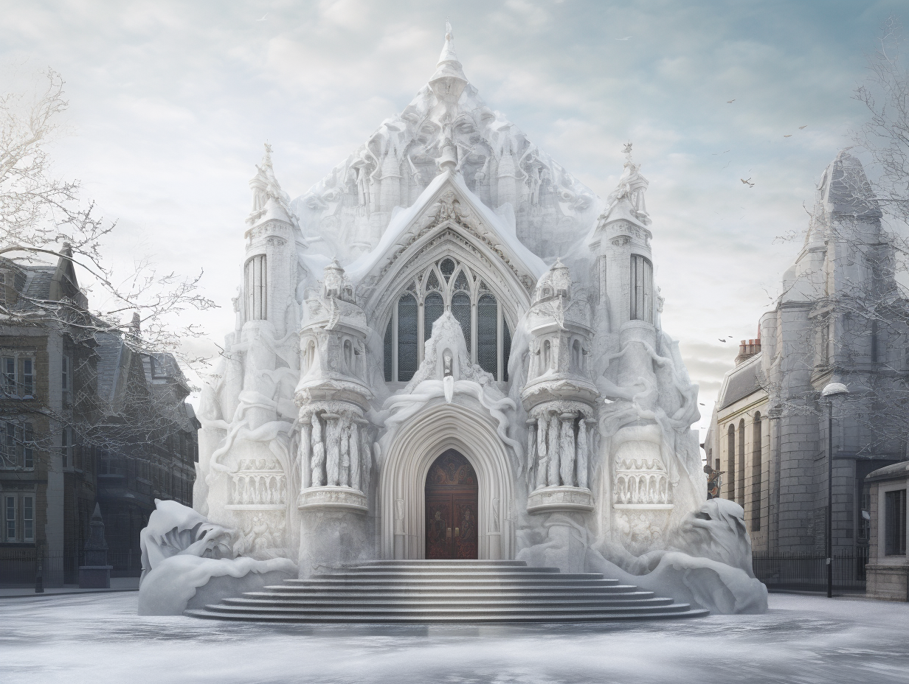

# The Temple of Kaikkea

-    :octicons-location-24:{ .lg .middle } A [Skaer](<../skaerhem/skaerhem.md>) temple of [Kaikkea](<../../../cosmology/gods/incorporeal-gods/kaikkea.md>) in the [Free City of Tollen](<./tollen.md>), the [Western Green Sea Region](<../western-green-sea-region.md>)  

An ancient building in [Godshome](<./godshome.md>) in [Tollen](<./tollen.md>), built by the original [Skaer](<../skaerhem/skaerhem.md>) settlers of this region long ago. The temple remains a highly sacred place to the Skaer, and a priest always serves to make sure that [Kaikkea](<../../../cosmology/gods/incorporeal-gods/kaikkea.md>) can still be heard here. This is also the center of the small Skaer community in [Tollen](<./tollen.md>).

The temple is a striking circular building of brilliant white marble shaped like undulating wave.

