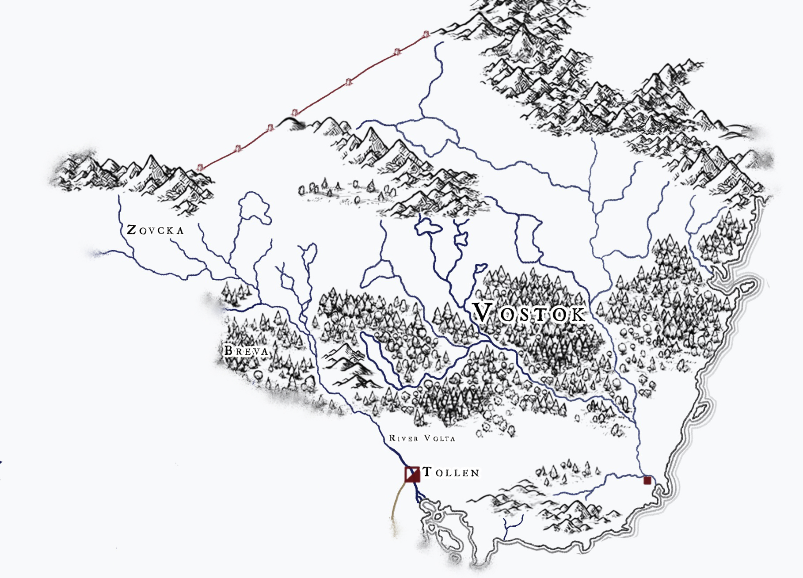

# Vostok
:speaker:{ .middle } *(VOS-tok)*  

-    :octicons-location-24:{ .lg .middle } A realm in the [Western Green Sea Region](<../western-green-sea-region.md>)  

Vostok, the "homeland of the Vos," is a land of many rivers, bitter winters, and few people, generally defined as the land northeast of the [Volta](<../../greater-sembara/rivers/volta-watershed/volta.md>) river and southwest of the [Sivnjo Mountains](<../../northern-green-sea/sivnjo-mountains.md>), between the [Green Sea](<../../green-sea.md>) and the cold dry plains of the kenku in the northwest. 

Most of the population lives in the southern part of Vostok, called Voslaag ("home of the lowlanders"; often called South Vostok or South Vosland in [Sembara](<../../greater-sembara/sembara/sembara.md>)), within a hundred miles of the coast, and along the lower [Kem](<../rivers/kem.md>) river valley. This is a region of few cities, few roads, and difficult travel, with lots of uninhabited land even within the most organized territories of major clans and chiefs. Boats, both on the rivers and the coastal [Green Sea](<../../green-sea.md>), are crucial to trade, travel, and communication throughout Voslaag. 

[Cymea](<../cymea/cymea.md>) and [Tollen](<../tollen/tollen.md>), with their strong naval traditions, have often looked to Voslaag for tribute and resources, whether extracted by violence or as part of recognition of an outside overlord. But these relationships - beyond some annual tribute (oftentimes labor, such as sailors for the navy) and a perhaps a personal relationship between a Vos and Cymean or [Tollen](<../tollen/tollen.md>) leader - have left little impact on the internal culture and politics of Vostok. 

Few people live in the forests and hills of the northern plateaus, the region called Voskald ("homeland of the people of the cold"; often referred to as North Vostok or North Vosland in Sembara). Much more than the people of Voslaag, the Voskalders are closely connected by culture and shared history with the [Zimkova](<../../greater-sembara/zimkova/zimkova.md>), especially the traditionalists in the north.  

Far to the north, the border of Vostok is demarcated with a massive and ancient wall. Stretching 400 miles from the [Sentinel Range](<../../sentinel-range/sentinel-range.md>) to the [Sivnjo Mountains](<../../northern-green-sea/sivnjo-mountains.md>), this wall is no longer maintained or defended by the people of Vostok or anyway else. It was built in some distant mythical past, so long ago that none now remember its purpose, except perhaps among the elves. Yet, due to the skill and magic woven into its construction, it still stands nearly as strong as ever today. 

