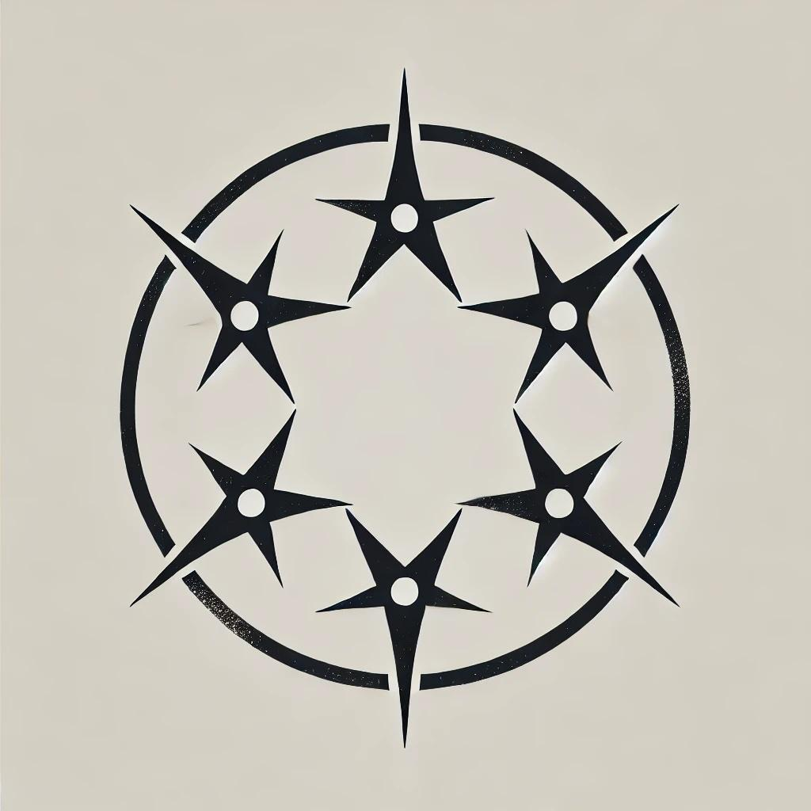
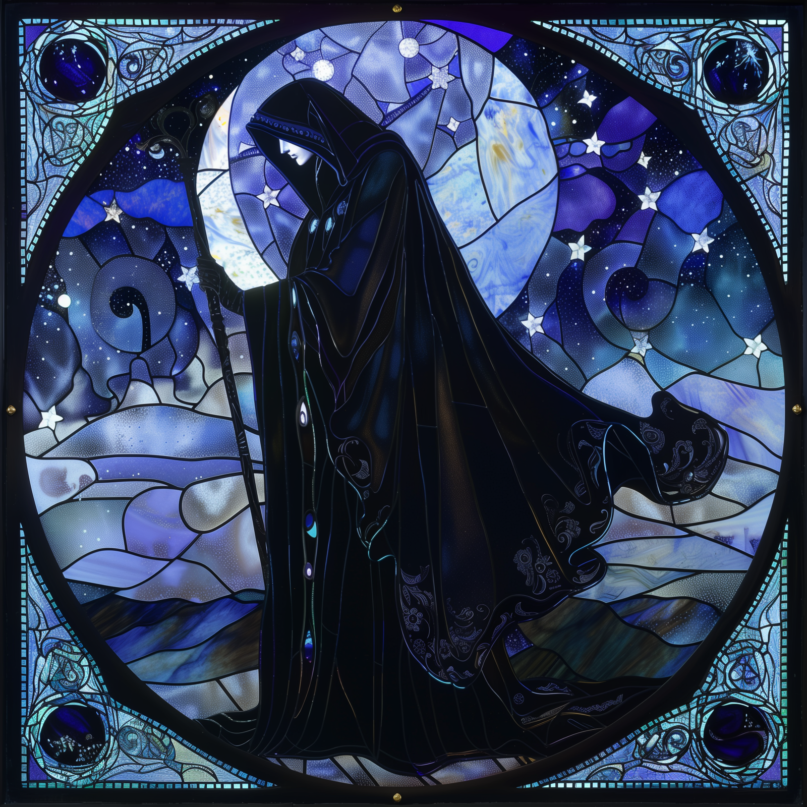
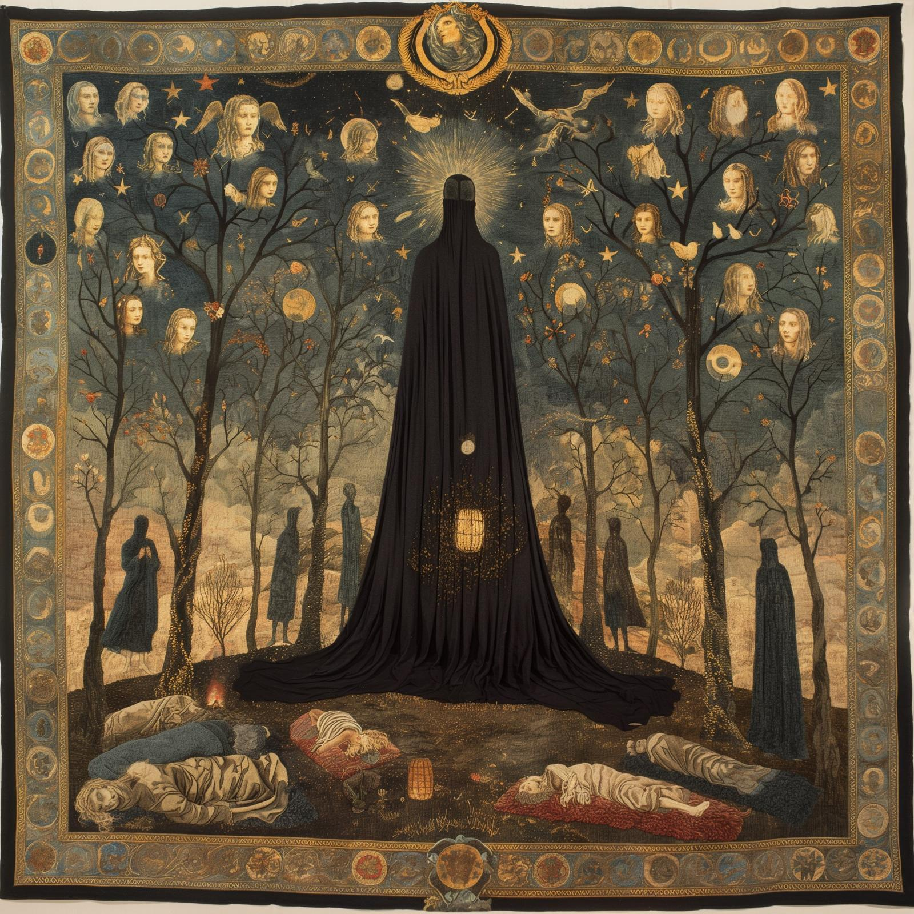

# The Night Queen

A deity in the [Mos Numena](<../../../religions/mos-numena/mos-numena.md>) pantheon, and one of the [Incorporeal Gods](<../incorporeal-gods.md>) of humanity. 

The Night Queen is usually depicted as a pale woman, often of indeterminate age, often old. She is usually depicted wearing black robes, and with her face cloaked in shadow, often leaning on a cane. She is the Goddess of darkness, death, and sleep, especially associated with the transition from life to death, and the much rarer transition back to life again. She is the defender against undead and the unnatural extension of life, and associated with the night, and winter, and the virtue of compassion. She watches over funerals, and keeps the night safe.

{align="right"; width="180"}Her holy symbol is a crown of stars, usually depicted as five or six stylized stars in a circle, representing a top-down view of the points of a crown. Sometimes, instead of a stylized crown, she is represented by three stars in an arch with an implied horizon, representing the transition between day and night (and also between life and death).

In art, the Night Queen is often depicted the protector of the dead and of spirits, and the guide who ensures that the dead do not return to haunt the living. Art depicting the Night Queen tends to somber colors, with a starkness that highlights her connection to the night and winter. 

