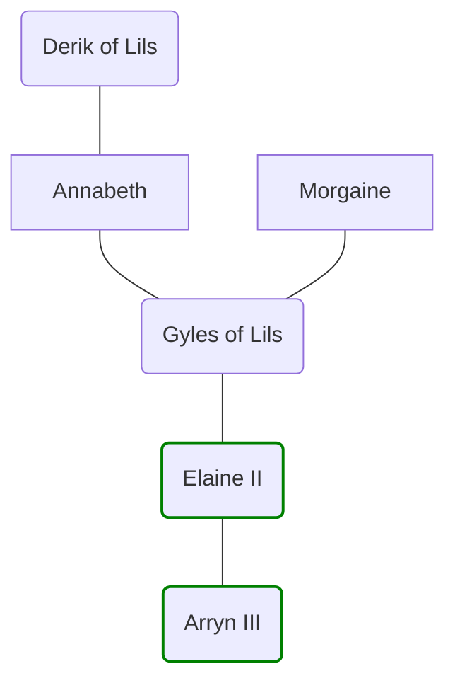

# The House of Lils
>[!info]+ Summary
>

A cadet branch of the [House of Sewick](<./house-of-sewick.md>), which came to the throne in the 1720s. The house descends from the youngest child of [Elaine I](<../../people/historical-figures/sembaran-royalty/elaine-i.md>) and a Tyrwinghan [Oracle of the Riven](<../oracle-of-the-riven.md>), [Morgaine](<../../people/historical-figures/sembaran-royalty/morgaine.md>).

