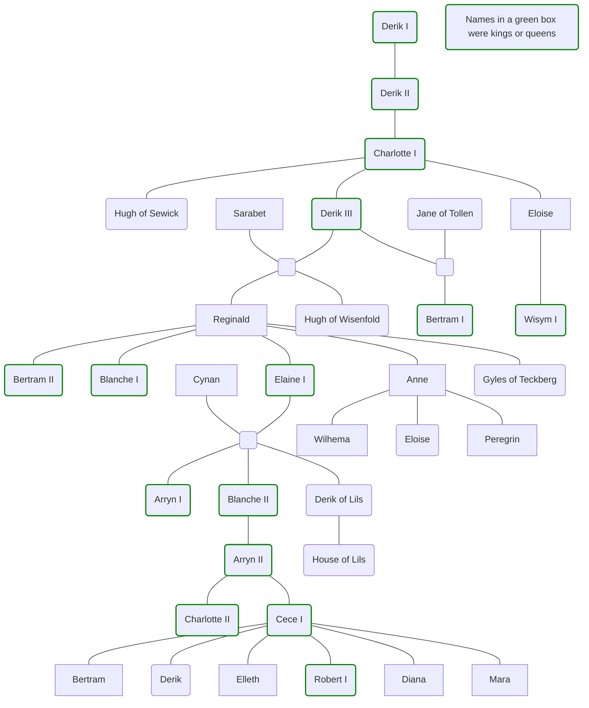

# The House of Sewick

The founding royal house of modern [Sembara](<../../gazetteer/greater-sembara/sembara/sembara.md>), the House of Sewick ruled between the 1420s and the 1720s. A cadet branch, the [House of Lils](<./house-of-lils.md>) rules today.

