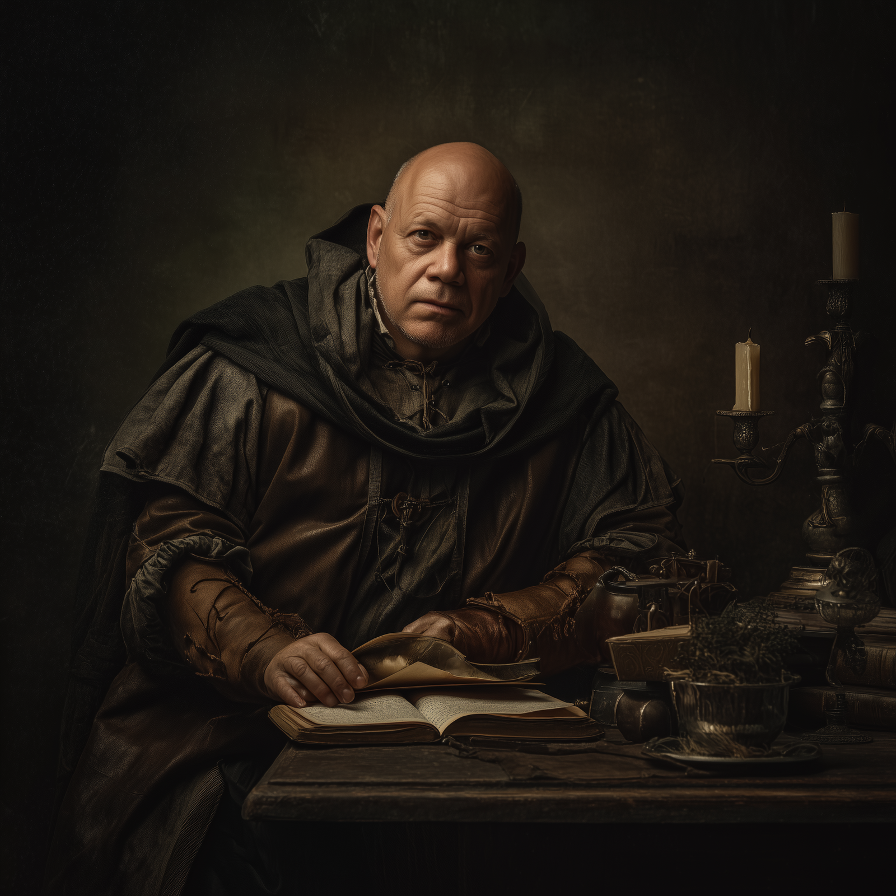

# Guilhem Du Pont
:speaker:{ .middle } *(GHEE-yem duh PONT)*  

- :octicons-info-24:{ .lg .middle } __Biographical Information__

    An [Aurbeze](<../../gazetteer/upper-istaros/refounded-alliance-of-aurbez/refounded-alliance-of-aurbez.md>) [human](<../../creatures/species/humans.md>) (he/him)  
    Born DR 1698 (52 years old)  
    { .bio }

    Based in [Aursenbourg](<../../gazetteer/upper-istaros/refounded-alliance-of-aurbez/aursenbourg.md>), the [Refounded Alliance of Aurbez](<../../gazetteer/upper-istaros/refounded-alliance-of-aurbez/refounded-alliance-of-aurbez.md>)

:octicons-location-24:{ .lg .middle } Met by the [Dunmar Fellowship](<../pcs/dunmar-fellowship/dunmar-fellowship.md>) on August 7th, 1749 in [Three Wells](<../../gazetteer/upper-istaros/refounded-alliance-of-aurbez/three-wells.md>), the [Refounded Alliance of Aurbez](<../../gazetteer/upper-istaros/refounded-alliance-of-aurbez/refounded-alliance-of-aurbez.md>)  

{align="right"; width="400"}Guilhem is a middle-aged clerk of [Aursenbourg](<../../gazetteer/upper-istaros/refounded-alliance-of-aurbez/aursenbourg.md>) and civic representative to councils of the [Refounded Alliance of Aurbez](<../../gazetteer/upper-istaros/refounded-alliance-of-aurbez/refounded-alliance-of-aurbez.md>). He is known for meticulous record‑keeping and a cautious, civic‑minded approach to defense. His temperament trends anxious, but his focus remains squarely on the welfare of the city.

He is a stout man typically wearing immaculate woolen clothes and carrying an iron badge of [Aursenbourg](<../../gazetteer/upper-istaros/refounded-alliance-of-aurbez/aursenbourg.md>). 
## Events
- Aug 07, 1749 DR: Joined the war council in [Three Wells](<../../gazetteer/upper-istaros/refounded-alliance-of-aurbez/three-wells.md>), where he urged holding [Aursenbourg](<../../gazetteer/upper-istaros/refounded-alliance-of-aurbez/aursenbourg.md>)’s walls to shield the gathered refugees from the [Empress of Chaos](<../other-nonhumans/empress-of-chaos.md>)'s armies.

