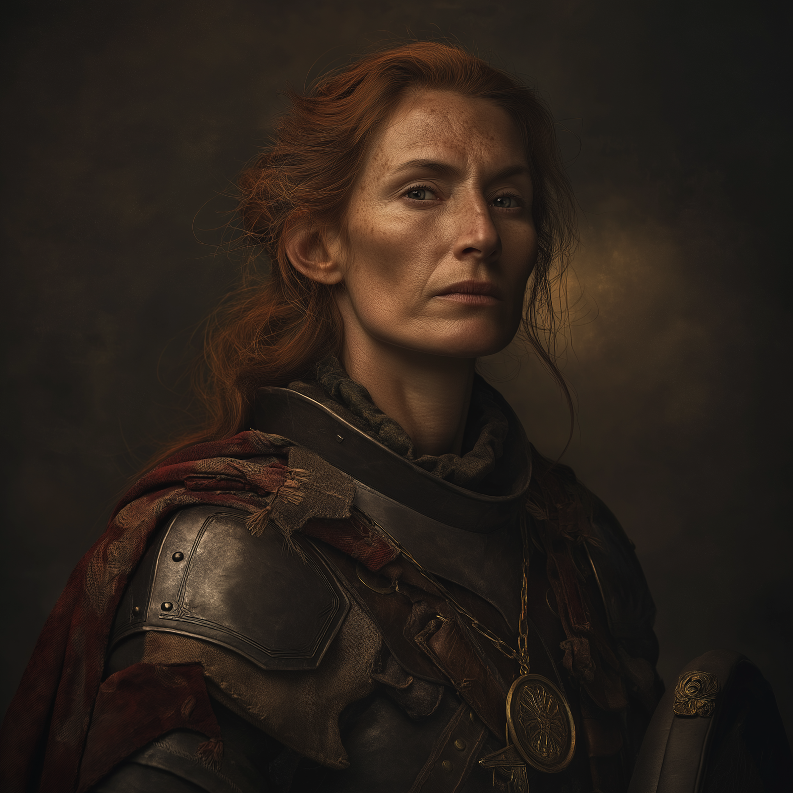

# Marguerite La Rousse
:speaker:{ .middle } *(mar-guh-REET la ROUSE)*  

- :octicons-info-24:{ .lg .middle } __Biographical Information__

    An Aurbeze [human](<../../species/humans.md>) (she/her)  
    Born DR 1711 (38 years old)  
    { .bio }

    Originally from: Unknown

:octicons-location-24:{ .lg .middle } Currently in [Three Wells](<../../gazetteer/upper-istaros/refounded-alliance-of-aurbez/three-wells.md>), the [Refounded Alliance of Aurbez](<../../gazetteer/upper-istaros/refounded-alliance-of-aurbez/refounded-alliance-of-aurbez.md>)

:octicons-location-24:{ .lg .middle } Met by the [Dunmar Fellowship](<../pcs/dunmar-fellowship/dunmar-fellowship.md>) on August 7th, 1749 in [Three Wells](<../../gazetteer/upper-istaros/refounded-alliance-of-aurbez/three-wells.md>), the [Refounded Alliance of Aurbez](<../../gazetteer/upper-istaros/refounded-alliance-of-aurbez/refounded-alliance-of-aurbez.md>)  

{align="right"; width="400"}Marguerite grew up in a sheep-herding family, and spend her childhood as a shepherd in the highlands of the [Aurbez Plateau](<../../gazetteer/upper-istaros/aurbez-plateau.md>). She is now a skilled fighter and militia captain. 

