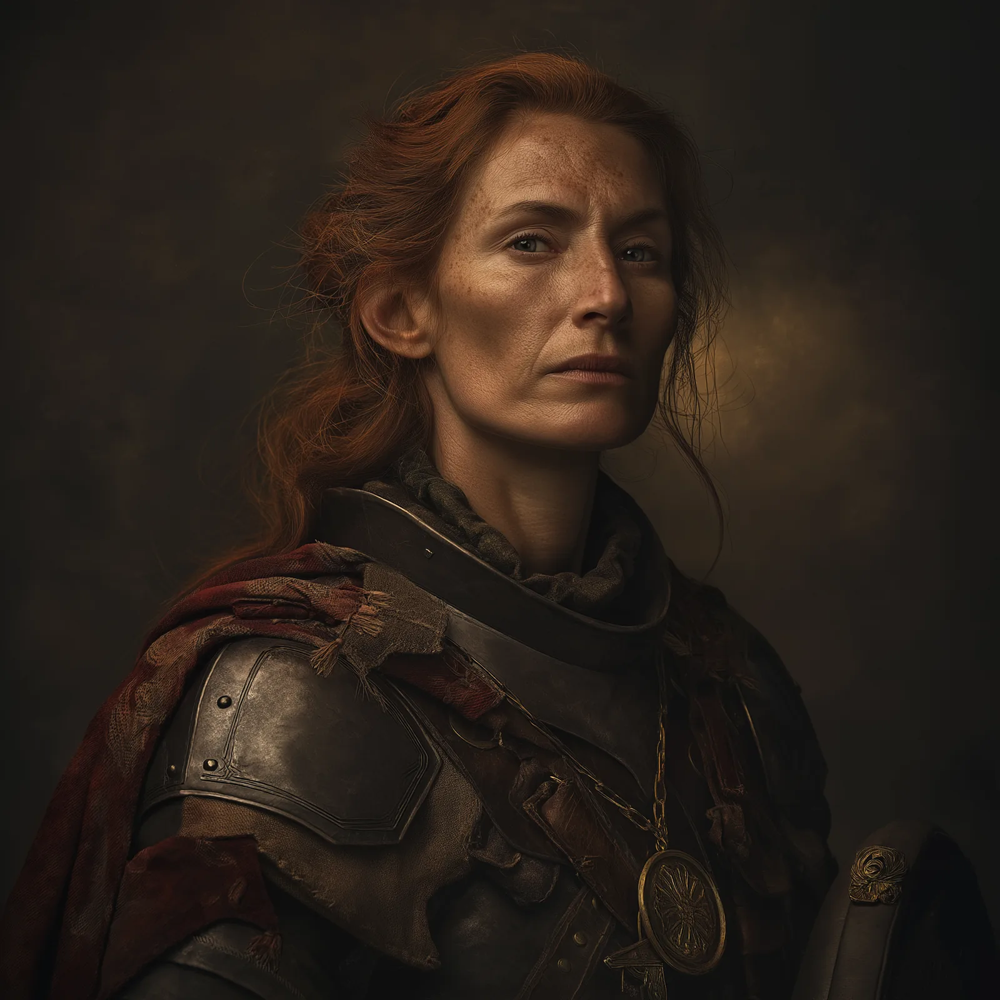

# Marguerite La Rousse
:speaker:{ .middle } *(mar-guh-REET la ROUSE)*  

- :octicons-info-24:{ .lg .middle } __Biographical Information__

    An [Aurbeze](<../../gazetteer/upper-istaros/refounded-alliance-of-aurbez/refounded-alliance-of-aurbez.md>) [human](<../../creatures/species/humans.md>) (she/her)  
    Born DR 1711 (39 years old)  
    { .bio }

    Based in the [Aurbez Plateau](<../../gazetteer/upper-istaros/aurbez-plateau.md>)

:octicons-location-24:{ .lg .middle } Met by the [Dunmar Fellowship](<../pcs/dunmar-fellowship/dunmar-fellowship.md>) on August 7th, 1749 in [Three Wells](<../../gazetteer/upper-istaros/refounded-alliance-of-aurbez/three-wells.md>), the [Refounded Alliance of Aurbez](<../../gazetteer/upper-istaros/refounded-alliance-of-aurbez/refounded-alliance-of-aurbez.md>)  

{align="right"; width="400"}Marguerite is an Aurbeze militia captain and capable fighter, formerly a highland shepherd on the [Aurbez Plateau](<../../gazetteer/upper-istaros/aurbez-plateau.md>). She commands respect among the plateau militias, bringing practical experience and resolve to local defense. Her leadership emphasizes endurance, coordination with the [Rangers](<../../groups/rangers.md>), and protection of rural households.

She is a sun-browned woman with red hair, typically wearing her worn but carefully maintained brigandine armor. She carries an ash halberd and often wears a homespun scarf knotted like a banner.
## Events
- Aug 07, 1749 DR: Joined the war council in [Three Wells](<../../gazetteer/upper-istaros/refounded-alliance-of-aurbez/three-wells.md>), called to answer the [Empress of Chaos](<../other-nonhumans/empress-of-chaos.md>), where she argued for resistance and for defending the plateau approaches.

