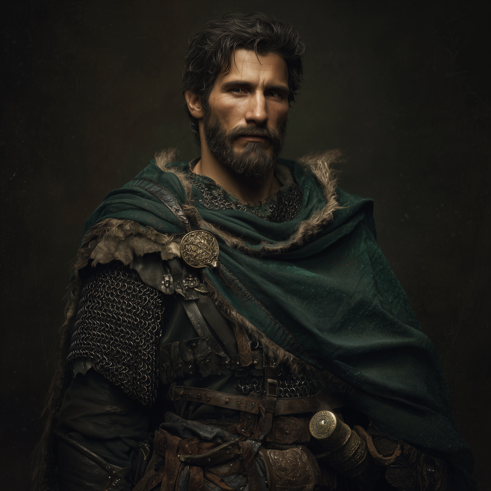

# Martin Stronbow

- :octicons-info-24:{ .lg .middle } __Biographical Information__

    An [Isinguer](<../../history/istabor-alliance.md>) [human](<../../species/humans.md>) (he/him)  
    Born DR 1716 (33 years old)  
    { .bio }

    Originally from: Unknown

:octicons-location-24:{ .lg .middle } Currently in [Three Wells](<../../gazetteer/upper-istaros/refounded-alliance-of-aurbez/three-wells.md>), the [Refounded Alliance of Aurbez](<../../gazetteer/upper-istaros/refounded-alliance-of-aurbez/refounded-alliance-of-aurbez.md>)

:octicons-location-24:{ .lg .middle } Met by the [Dunmar Fellowship](<../pcs/dunmar-fellowship/dunmar-fellowship.md>) on August 7th, 1749 in [Three Wells](<../../gazetteer/upper-istaros/refounded-alliance-of-aurbez/three-wells.md>), the [Refounded Alliance of Aurbez](<../../gazetteer/upper-istaros/refounded-alliance-of-aurbez/refounded-alliance-of-aurbez.md>)  

{align="right"; width="400"}Martin Strongbow is a captain of the [The Rangers](<../../groups/the-rangers.md>), a wanderer, a skilled tactician, and a leader. Although he grew up to the north, he has spent most of his life patrolling the edges of the [Plaguelands](<../../gazetteer/upper-istaros/plaguelands.md>) and is acknowledged as the informal leader of the [The Rangers](<../../groups/the-rangers.md>) in the [Refounded Alliance of Aurbez](<../../gazetteer/upper-istaros/refounded-alliance-of-aurbez/refounded-alliance-of-aurbez.md>).