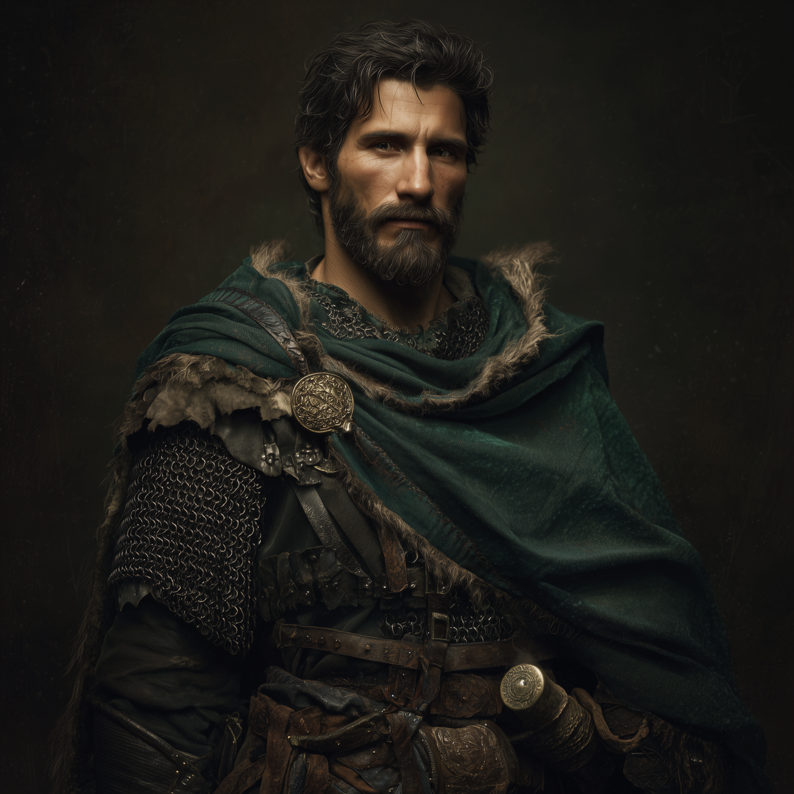

# Martin Strongbow

- :octicons-info-24:{ .lg .middle } __Biographical Information__

    An [Isinguer](<../../history/historical-realms/istabor-alliance.md>) [human](<../../creatures/species/humans.md>) (he/him)  
    Born DR 1716 (34 years old)  
    A Captain of the The Rangers  
    { .bio }

    Originally from: Unknown

:octicons-location-24:{ .lg .middle } Last known location (as of August 7th, 1749): [Three Wells](<../../gazetteer/upper-istaros/refounded-alliance-of-aurbez/three-wells.md>), the [Refounded Alliance of Aurbez](<../../gazetteer/upper-istaros/refounded-alliance-of-aurbez/refounded-alliance-of-aurbez.md>)

:octicons-location-24:{ .lg .middle } Met by the [Dunmar Fellowship](<../pcs/dunmar-fellowship/dunmar-fellowship.md>) on August 7th, 1749 in [Three Wells](<../../gazetteer/upper-istaros/refounded-alliance-of-aurbez/three-wells.md>), the [Refounded Alliance of Aurbez](<../../gazetteer/upper-istaros/refounded-alliance-of-aurbez/refounded-alliance-of-aurbez.md>)  

{align="right"; width="400"}Martin is an Isinguer human and a captain of the [Rangers](<../../groups/rangers.md>). He is a a seasoned tactician and often serves as the coordinator of Ranger operations within the [Refounded Alliance of Aurbez](<../../gazetteer/upper-istaros/refounded-alliance-of-aurbez/refounded-alliance-of-aurbez.md>).

## Background

Martin was the eldest son of wildcat miners on the northern edge of the [Aurbez Plateau](<../../gazetteer/upper-istaros/aurbez-plateau.md>), raised with stories of his [Isinguer](<../../gazetteer/upper-istaros/isingue.md>) heritage. He grew up poor, and joined [Rangers](<../../groups/rangers.md>) young, with a zeal for the cause of [Isingue](<../../gazetteer/upper-istaros/isingue.md>) instilled by his parents. Although sometimes rash, his brilliant tactical acumen and daring style served him; he led numerous raids into the ash storms of the [Plaguelands](<../../gazetteer/upper-istaros/plaguelands.md>) during his 20s, making a name for himself across the [Refounded Alliance of Aurbez](<../../gazetteer/upper-istaros/refounded-alliance-of-aurbez/refounded-alliance-of-aurbez.md>). 

More recently, he has honed a reputation for disciplined scouting and clear‑headed command. Within [Rangers](<../../groups/rangers.md>) he is very popular with the rank-and-file, and widely deferred to on questions of deployment, timing, and the use of irregular forces. His leadership emphasizes mobility, concealment, and decisive strikes, though at times he is too eager to hear all sides and encourage lengthy discussion. 

Martin is a well-built, dashing man in his 30s, with dark hair and a tidy beard. He generally wears chain mail and a river-green cloak. 

## Events
- Aug 07, 1749 DR: [Called the council](<../../campaigns/dunmari-frontier-campaign/session-notes/session-130-dufr.md>) at [Three Wells](<../../gazetteer/upper-istaros/refounded-alliance-of-aurbez/three-wells.md>) to order and helped shape the Alliance’s defensive response to the [Empress of Chaos](<../other-nonhumans/empress-of-chaos.md>)'s threat.
- Aug 10, 1749 DR: [Coordinated defenses](<../../campaigns/dunmari-frontier-campaign/session-notes/session-132-dufr.md>) of the Heartroot with the [Dunmar Fellowship](<../pcs/dunmar-fellowship/dunmar-fellowship.md>) via dream counsel.
- Aug 12, 1749 DR: Led [Rangers](<../../groups/rangers.md>) into battle to defend the Heartroot against the [Empress of Chaos](<../other-nonhumans/empress-of-chaos.md>) and her armies. [Emerged victorious](<../../campaigns/dunmari-frontier-campaign/session-notes/session-133-dufr.md>) with the aid of the [Dunmar Fellowship](<../pcs/dunmar-fellowship/dunmar-fellowship.md>). 
