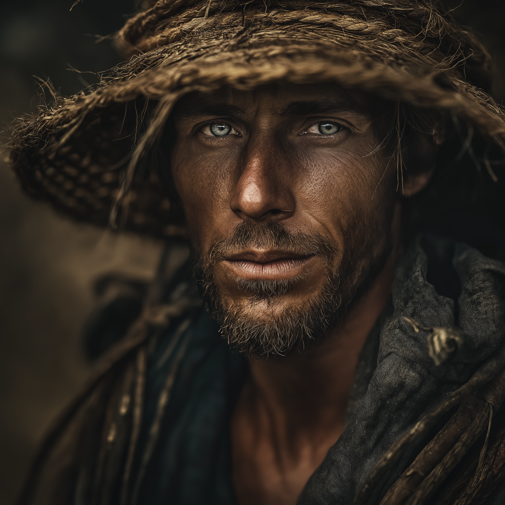

# Perrin Du Bois

- :octicons-info-24:{ .lg .middle } __Biographical Information__

    An Aurbeze [human](<../../species/humans.md>) (he/him)  
    { .bio }

    Originally from: Unknown

:octicons-location-24:{ .lg .middle } Last known location (as of August 7th, 1749): [Three Wells](<../../gazetteer/upper-istaros/refounded-alliance-of-aurbez/three-wells.md>), the [Refounded Alliance of Aurbez](<../../gazetteer/upper-istaros/refounded-alliance-of-aurbez/refounded-alliance-of-aurbez.md>)

:octicons-location-24:{ .lg .middle } Met by the [Dunmar Fellowship](<../pcs/dunmar-fellowship/dunmar-fellowship.md>) on August 7th, 1749 in [Three Wells](<../../gazetteer/upper-istaros/refounded-alliance-of-aurbez/three-wells.md>), the [Refounded Alliance of Aurbez](<../../gazetteer/upper-istaros/refounded-alliance-of-aurbez/refounded-alliance-of-aurbez.md>)  

{align="right"; width="400"}Perrin is a beekeeper by trade, and speaks for many of the smallholds and isolated farms along the [Aurbez Plateau](<../../gazetteer/upper-istaros/aurbez-plateau.md>). 

