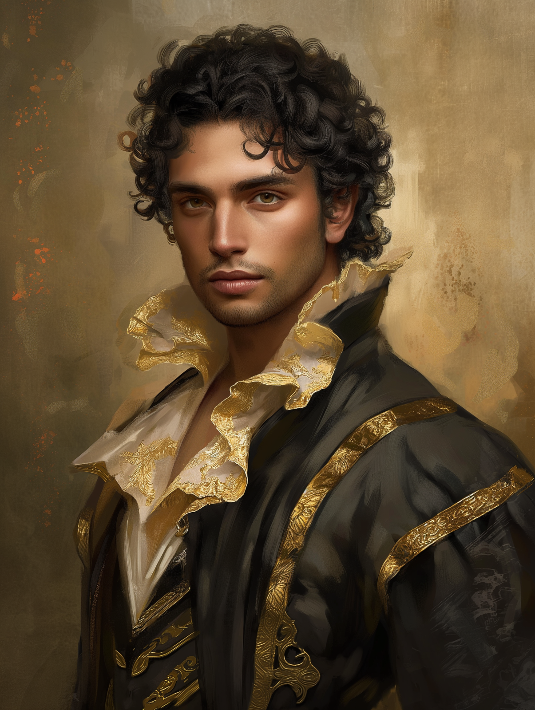

# Fausto

- :octicons-info-24:{ .lg .middle } __Biographical Information__

    A [Chardonian](<../../gazetteer/west-coast/chardonian-empire/chardonian-empire.md>) [human](<../../species/humans/humans.md>) (he/him)  
    Born DR 1714 (35 years old)  
    Member of the [Society of the Open Scroll](<../../groups/chardonian-organizations/society-of-the-open-scroll.md>), and [The Cleansed](<../../groups/the-cleansed.md>)  
    { .bio }

    Originally from: Unknown
    Based in [Chardon](<../../gazetteer/west-coast/chardonian-empire/chardon/chardon.md>), the [Chardonian Empire](<../../gazetteer/west-coast/chardonian-empire/chardonian-empire.md>)

{align="right"; width="400"}A young, striking man, with fine features, well groomed curly black hair, and elegant dress that clearly yet subtly displays his wealth. Fausto is not from a wealthy background, and he does not speak of his childhoood. All manner of wild tales exist to explain his obvious wealth, the most common of which is that he was an adventurer and explorer in his 20s, retiring to Chardon with the wealth of an ancient dragon hoard. 

Although he is well-connected, Fausto lacks official rank at either the [University of Chardon](<../../gazetteer/west-coast/chardonian-empire/chardon/university-of-chardon.md>) or the Great Library, and is not known for his scholarship. However, he is skilled at spreading his wealth around, and his parties are popular among both rich and powerful of the city and the scholars and mages of the University hoping for funding. He is a major funder of treasure hunters associated with the [Society of the Open Scroll](<../../groups/chardonian-organizations/society-of-the-open-scroll.md>). He funded many expeditions across [Dunmar](<../../gazetteer/greater-dunmar/realms/dunmar/dunmar.md>), including [Kadmos](<./kadmos.md>) and company (rumored); [Servius](<./servius.md>); and [Dee Wildcloak](<../halflings/dee-wildcloak.md>), [Dain Goldhammer](<../dwarves/dain-goldhammer.md>), and [Alban](<./alban.md>)'s expedition to [Stormcaller Tower](<../../gazetteer/greater-dunmar/dunmari-basin/stormcaller-tower.md>). He probably also funded [Arcus](<./arcus.md>), given that he traveled with many of these people.

Fausto is also a powerful enchanter who tricked [Dunmar Fellowship](<../pcs/dunmar-fellowship/dunmar-fellowship.md>), attempting to capture or kill them when they came to his tower to make an exchange for [Hralgar's Eyes](<../../campaigns/dunmari-frontier/treasure/notable-items/hralgar-s-eyes.md>). 

He is also apparently a member of a secret organization called [The Cleansed](<../../groups/the-cleansed.md>). 

