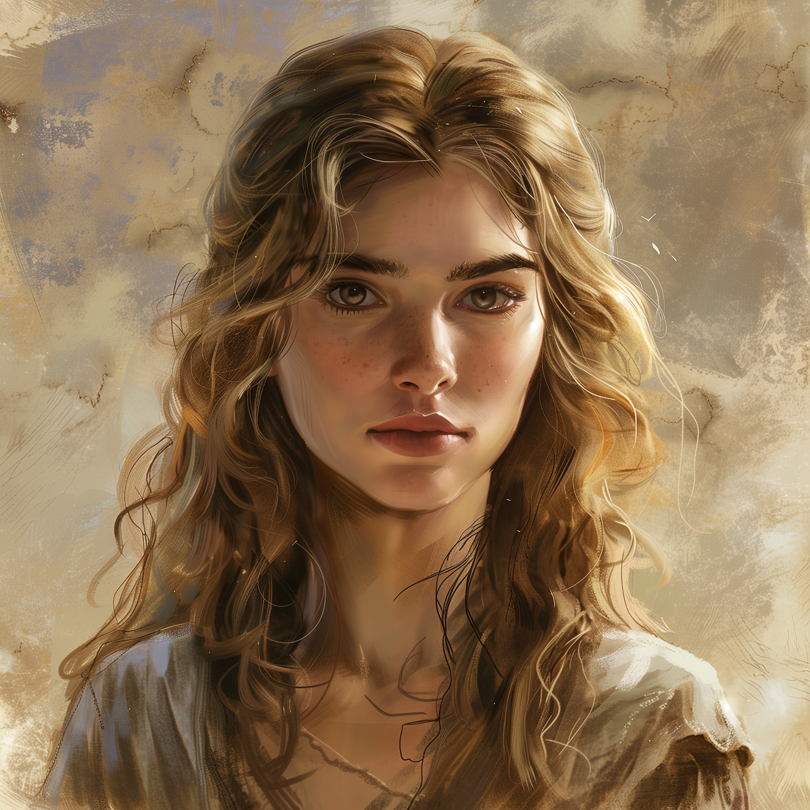

# Isabetta

- :octicons-info-24:{ .lg .middle } __Biographical Information__

    A [Chardonian](<../../gazetteer/west-coast/chardonian-empire/chardonian-empire.md>) [human](<../../species/children-of-divine-creation/humans/humans.md>) (she/her)  
    Born DR 1731 (18 years old)  
    { .bio }

{align="right"; width="400"}A young woman with a beautiful voice, who frequently sings at [The Drunken Dolphin](<../../gazetteer/west-coast/chardonian-empire/apporia/the-drunken-dolphin.md>) in [Castrella](<../../gazetteer/west-coast/chardonian-empire/apporia/castrella.md>). 

