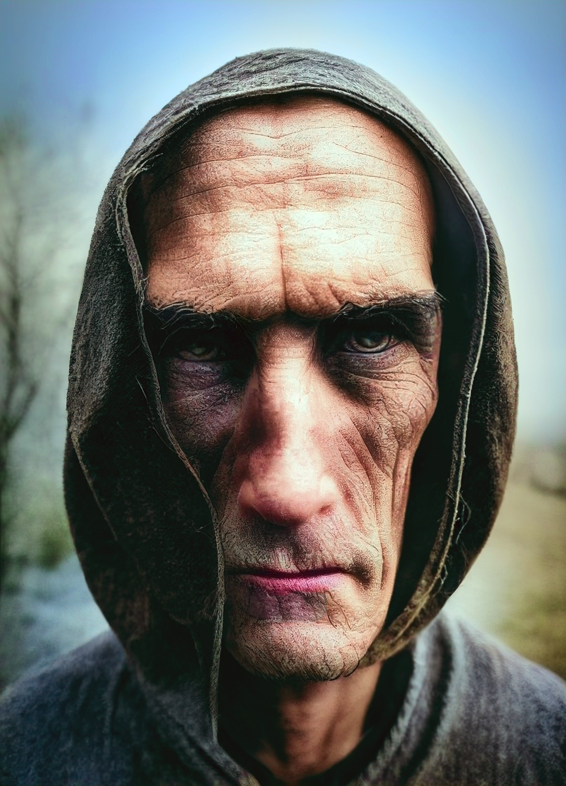

# Kadmos
>[!info]+ Biographical Info
> A [Chardonian](<../../gazetteer/west-coast/chardonian-empire/chardonian-empire.md>) [human](<../../species/humans/humans.md>) (he/him)
> 
> 
>> 
>>  Encountered by the [Dunmar Fellowship](<../pcs/dunmar-fellowship/dunmar-fellowship.md>) on December 8th, 1748 in [Uzgukhar](<../../gazetteer/istaros-watershed/xurkhaz/uzgukhar.md>), [Xurkhaz](<../../gazetteer/istaros-watershed/xurkhaz/xurkhaz.md>), the [Garamjala Desert](<../../gazetteer/greater-dunmar/garamjala-plateau/garamjala-desert.md>) 

A mysterious figure who doesn't speak unless necessary, the leader of this company, with [Hektor](<./hektor.md>), [Marcella](<./marcella.md>), [Antonia](<./antonia.md>), and [Casian](<./casian.md>). 

A tall Chardonian man, cloaked and hooded, wearing dark, travel-stained leather armor, without obvious weapons. A spellcaster, who took on an undead visage in combat and whose spirit seems touched by a darkness. 

A character of dubious morality, clearly willing and able to use enchantment magic to get what he wants, and happy to provoke a fight. 

