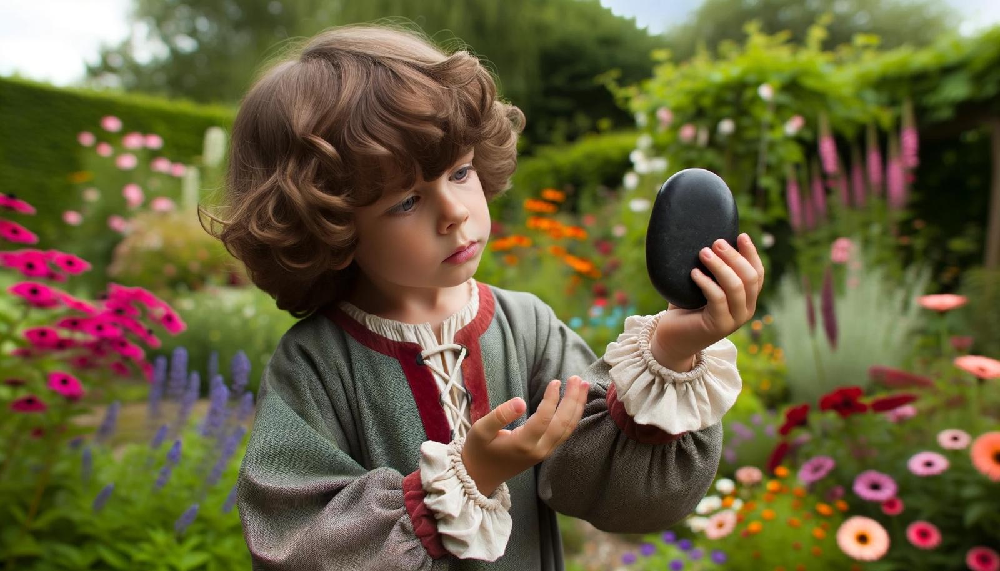

# Lucius

- :octicons-info-24:{ .lg .middle } __Biographical Information__

    A [Chardonian](<../../gazetteer/greater-chardon/chardonian-empire/chardonian-empire.md>) [human](<../../species/humans.md>) (he/him)  
    Born DR 1743 (6 years old)  
    { .bio }

    Based in [Luminatia](<../../gazetteer/greater-chardon/chardonian-empire/luminatia.md>), the [Chardonian Empire](<../../gazetteer/greater-chardon/chardonian-empire/chardonian-empire.md>)

:octicons-location-24:{ .lg .middle } Reached via sending stone by the [Dunmar Fellowship](<../pcs/dunmar-fellowship/dunmar-fellowship.md>) on January 8th, 1749 in [Luminatia](<../../gazetteer/greater-chardon/chardonian-empire/luminatia.md>), the [Chardonian Empire](<../../gazetteer/greater-chardon/chardonian-empire/chardonian-empire.md>)  

{align="right"; width="420"}A boy of about 5, who lives with his mother, [Livia](<./livia.md>), in the village of [Luminatia](<../../gazetteer/greater-chardon/chardonian-empire/luminatia.md>), near [Lake Valandros](<../../gazetteer/greater-chardon/lake-valandros.md>) in the [Chardonian Empire](<../../gazetteer/greater-chardon/chardonian-empire/chardonian-empire.md>). He found a stone, in which he believes his imaginary friend Benji lives, in his [father's](<./claudio.md>) study, after his father abandoned the family. 

- Jan 08, 1749 DR Lucius' imaginary friend Benji spoke to him from the stone he carries, and asked him about his life. 

