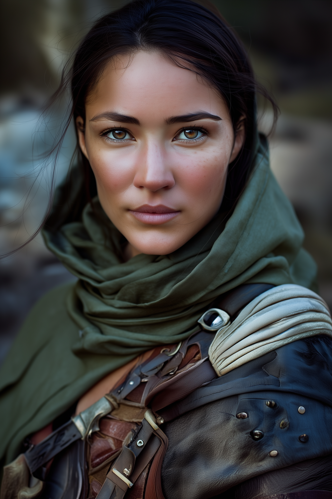

# Marcella

- :octicons-info-24:{ .lg .middle } __Biographical Information__

    A [Chardonian](<../../gazetteer/west-coast/chardonian-empire/chardonian-empire.md>) [human](<../../species/humans/humans.md>) (she/her)  
    Born DR 1718 (31 years old)  
    { .bio }

    Originally from: [Chardon](<../../gazetteer/west-coast/chardonian-empire/chardon/chardon.md>), the [Chardonian Empire](<../../gazetteer/west-coast/chardonian-empire/chardonian-empire.md>)

:octicons-location-24:{ .lg .middle } 

:octicons-location-24:{ .lg .middle } Scryed by [Delwath](<../pcs/dunmar-fellowship/delwath.md>) on October 23rd, 1748 in [Ausson's Crossing](<../../gazetteer/greater-sembara/refounded-alliance-of-aurbez/ausson-s-crossing.md>), [Laicon](<../../gazetteer/greater-sembara/refounded-alliance-of-aurbez/laicon.md>), the [Refounded Alliance of Aurbez](<../../gazetteer/greater-sembara/refounded-alliance-of-aurbez/refounded-alliance-of-aurbez.md>)  

A nondescript Chardonian woman, short brown hair and a plain face. An archer, skilled with a bow, wears well-tended leather armor under a traveling cloak. 

Traveled uneasily with [Kadmos](<./kadmos.md>), [Hektor](<./hektor.md>), [Casian](<./casian.md>), and [Antonia](<./antonia.md>). 

Felt forced to try to steal from party in [Session 44 (DuFr)](<../../campaigns/dunmari-frontier/session-notes/session-44-dufr.md>), but when given the push by [Wellby](<../pcs/dunmar-fellowship/wellby.md>) to flee for herself at the end of battle figures out how to make her escape. Disappears when [Kadmos](<./kadmos.md>) and company are fighting kobolds in the [Myraeni Gap](<../../gazetteer/greater-dunmar/myraeni-gap.md>), heading for the Stoneborn and then Sembara. 

{width="500"}

