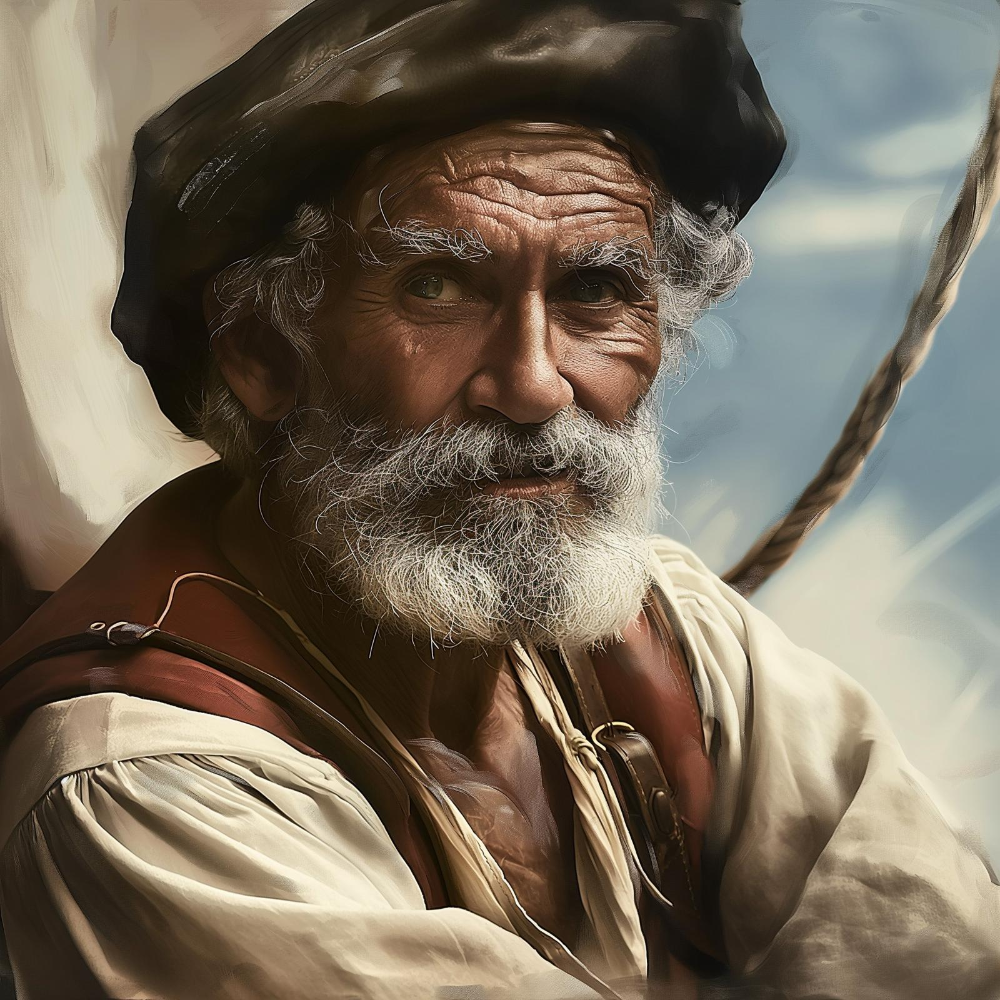

# Martino

- :octicons-info-24:{ .lg .middle } __Biographical Information__

    A [Chardonian](<../../gazetteer/west-coast/chardonian-empire/chardonian-empire.md>) [human](<../../species/children-of-divine-creation/humans/humans.md>) (he/him)  
    Born DR 1681 (68 years old)  
    { .bio }

    Based in [Artevus](<../../gazetteer/west-coast/chardonian-empire/apporia/artevus.md>), [Portalia](<../../gazetteer/west-coast/chardonian-empire/apporia/portalia.md>), the [Chardonian Empire](<../../gazetteer/west-coast/chardonian-empire/chardonian-empire.md>)

:octicons-location-24:{ .lg .middle } Currently in the [Summer's Breeze](<../../things/ships/summer-s-breeze.md>), the [Gulf of Chardon](<../../gazetteer/west-coast/gulf-of-chardon.md>), the [Endless Ocean](<../../gazetteer/endless-ocean/endless-ocean.md>)

{align="right"; width="400"}Martino is a retired sailor, fisherman, and navigator. He once sailed widely along the coasts of [Apporia](<../../gazetteer/west-coast/chardonian-empire/apporia/apporia.md>), seeking the best fishing grounds, until he was hurt in a storm and lost most of the use of his right hand. 

He is extremely knowledgeable about the waters and coasts of [Apporia](<../../gazetteer/west-coast/chardonian-empire/apporia/apporia.md>), but now spends his days hanging around [Artevus](<../../gazetteer/west-coast/chardonian-empire/apporia/artevus.md>), gazing out to sea. 

