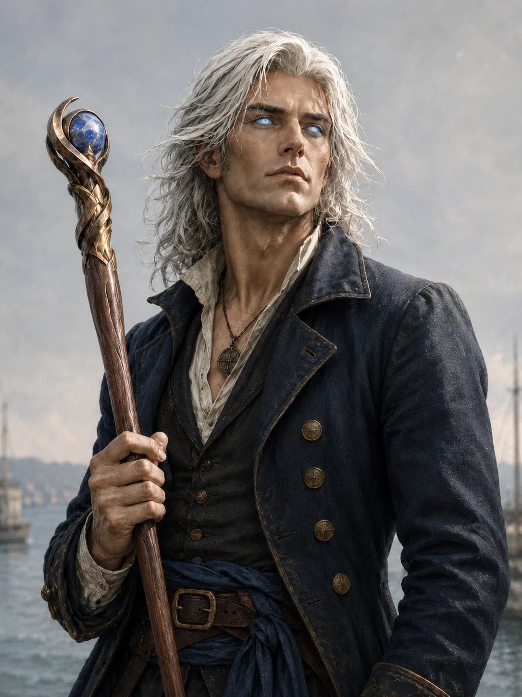

# Tiberius

- :octicons-info-24:{ .lg .middle } __Biographical Information__

    A [Chardonian](<../../gazetteer/greater-chardon/chardonian-empire/chardonian-empire.md>) [human](<../../creatures/species/humans.md>) (he/him)  
    Windcaller of the Chardonian Navy, and the [Auratan's Pride](<../../things/ships/auratan-s-pride.md>)  
    { .bio }

    Based in [Chardon](<../../gazetteer/greater-chardon/chardonian-empire/chardon/chardon.md>), the [Chardonian Empire](<../../gazetteer/greater-chardon/chardonian-empire/chardonian-empire.md>)

:octicons-location-24:{ .lg .middle } Met by the [Dunmar Fellowship](<../pcs/dunmar-fellowship/dunmar-fellowship.md>) on June 27th, 1749 in [Chardon](<../../gazetteer/greater-chardon/chardonian-empire/chardon/chardon.md>), the [Chardonian Empire](<../../gazetteer/greater-chardon/chardonian-empire/chardonian-empire.md>)  

{align="left"; width="400"}Tiberius is a [Chardonian](<../../gazetteer/greater-chardon/chardonian-empire/chardonian-empire.md>) [Windcaller](<../../groups/chardonian-organizations/windcallers.md>) in the service of [Mitus Verina Auratan](<mitus-verina-auratan.md>), the Magistros of [Chardon](<../../gazetteer/greater-chardon/chardonian-empire/chardon/chardon.md>). He serves aboard the [Auratan's Pride](<../../things/ships/auratan-s-pride.md>), one of the Magistros' naval flagships, and is one of the most powerful Windcallers in active service. 

He is a tall, lean man with shoulder-length silver-white hair and unnatural storm-blue eyes, lacking ordinary visible whites or pupils. He carries a polished oak staff tipped with a small sapphire orb. His eyes flare bright blue when he works magic or reacts strongly, and his spellcasting is marked by blue light, crackling lightning, and precise command of wind.

Tiberius is disciplined, wary, and cautious, though honest and open with those he trusts. Although he is a loyal confidant and friend of [Mitus Verina Auratan](<mitus-verina-auratan.md>), he is not a politician, and has little patience for the details of civic bureaucracy. He is, however, forceful in his views on [chalyte](<../../things/materials/chalyte.md>). He believes chalyte is dangerous when controlled by profit-seeking refineries, the [Hetaeri Magica](<../../groups/chardonian-organizations/hetaeri-magica.md>), or anyone who does not understand how to use it safely. He is especially critical of the [Chalyte Oligarchs of Chardon](<../../groups/chardonian-organizations/chalyte-oligarchs-of-chardon.md>) and repeatedly argues that the [Windcallers](<../../groups/chardonian-organizations/windcallers.md>) should have greater control over chalyte production and use. While this appears to be a genuinely held belief, his critics are quick to note it is also a belief that seems purpose-built to increase the power and influence of the secretive and mysterious Windcallers. 

