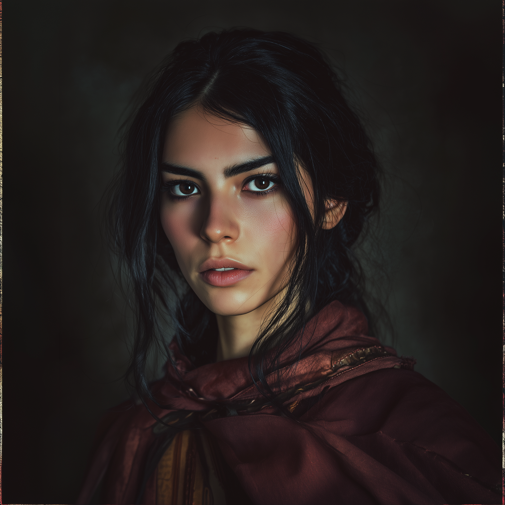

# Vola Forena

- :octicons-info-24:{ .lg .middle } __Biographical Information__

    A [Chardonian](<../../gazetteer/west-coast/chardonian-empire/chardonian-empire.md>) [human](<../../species/humans/humans.md>) (she/her)  
    Born DR 1721 (28 years old)  
    Member of the [Society of the Open Scroll](<../../groups/chardonian-organizations/society-of-the-open-scroll.md>)  
    { .bio }

    Based in [Chardon](<../../gazetteer/west-coast/chardonian-empire/chardon/chardon.md>), the [Chardonian Empire](<../../gazetteer/west-coast/chardonian-empire/chardonian-empire.md>)

:octicons-location-24:{ .lg .middle } Currently trapped in the [Mirror of Soul Trapping](<../../campaigns/dunmari-frontier/treasure/treasure-from-agata/mirror-of-soul-trapping.md>), stored on [Vindristjarna](<../../things/ships/vindristjarna.md>), owned by the [Dunmar Fellowship](<../pcs/dunmar-fellowship/dunmar-fellowship.md>)

## Overview

A Chardonian adventurer, treasure hunter, and sellsword.

Vola was born on the streets of [Chardon](<../../gazetteer/west-coast/chardonian-empire/chardon/chardon.md>), living a life of squalor, disease, and poverty. Grew up in the Riverside slurms, near the chalyte refineries.  Eventually discovered by [Agon](<./agon.md>), who helped her grow into her power and fulfill her potential.  She moved to the Academy district, specifically the Whitsun Tower area, and grew into her talents as a scout and rogue, eventually becoming a treasure hunter effectively working for [Agon](<./agon.md>) and the [Society of the Open Scroll](<../../groups/chardonian-organizations/society-of-the-open-scroll.md>). 

She is dedicated to the cause of the [Society of the Open Scroll](<../../groups/chardonian-organizations/society-of-the-open-scroll.md>), believing in their mission to secure dangerous knowledge from those who would use it for harm, and to preserve magic for future generations.

{width="400"}

## Relationships

- Friendly with [Dunmar Fellowship](<../pcs/dunmar-fellowship/dunmar-fellowship.md>), especially with [Kenzo](<../pcs/dunmar-fellowship/kenzo.md>), who had a similar childhood in Chardon. Somewhat awed by [Delwath](<../pcs/dunmar-fellowship/delwath.md>). Less friendy with [Riswynn](<../pcs/dunmar-fellowship/riswynn.md>), largely because or [Riswynn](<../pcs/dunmar-fellowship/riswynn.md>)'s distain. 
- Friendly with other adventurers for the Society of the Open Scroll, in particular [Dee Wildcloak](<../halflings/dee-wildcloak.md>), [Dain Goldhammer](<../dwarves/dain-goldhammer.md>), and [Alban](<./alban.md>)
- Looks up to her mentor, [Agon](<./agon.md>)
- Knows many other Chardonians, including [Kadmos](<./kadmos.md>), [Marcella](<./marcella.md>), [Hektor](<./hektor.md>), [Antonia](<./antonia.md>), and [Casian](<./casian.md>), whom she traveled with in early 1748, and [Crispus](<./crispus.md>) and [Fausto](<./fausto.md>), who are the funders of expeditions she has been on or knows of. Particularly friendly with [Marcella](<./marcella.md>). Dislikes [Casian](<./casian.md>), whom she considers an arrogant snob who believes he can take whatever he wants. 

## Chronology

- late 1747 - early 1748: travels with [Kadmos](<./kadmos.md>), [Marcella](<./marcella.md>), [Hektor](<./hektor.md>), [Antonia](<./antonia.md>), and [Casian](<./casian.md>), leaving Chardon, crossing Nevos Sea, traveling to Nayahar and then across the Yuvanti mountains to [Askandi](<../../gazetteer/greater-dunmar/realms/dunmar/central-dunmar/askandi.md>).  

- 5 Mar 1748: Leaves [Askandi](<../../gazetteer/greater-dunmar/realms/dunmar/central-dunmar/askandi.md>) for Raven's Hold
- 31 Mar 1748: Vola arrives at Raven's Hold. 
- 2 Apr 1748: Vola captured at Raven's Hold. 
- 12 Apr 1748: Rescued from captivity in Raven's Hold by [Dunmar Fellowship](<../pcs/dunmar-fellowship/dunmar-fellowship.md>)
- 12 Apr - 16 Apr 1748: Travels with [Dunmar Fellowship](<../pcs/dunmar-fellowship/dunmar-fellowship.md>)
- 16 Apr 1748: Leaves [Stormcaller Tower](<../../gazetteer/greater-dunmar/dunmari-basin/stormcaller-tower.md>) with [Riswynn](<../pcs/dunmar-fellowship/riswynn.md>) for Tokra, saying goodbye to [Dunmar Fellowship](<../pcs/dunmar-fellowship/dunmar-fellowship.md>)
- 26 Apr 1748: Arrives in Tokra. Parts ways with [Riswynn](<../pcs/dunmar-fellowship/riswynn.md>). Stays at [Kirian’s](<../../gazetteer/greater-dunmar/realms/dunmar/central-dunmar/tokra/kirians.md>). 

- 21 Aug 1748: Meets [Dunmar Fellowship](<../pcs/dunmar-fellowship/dunmar-fellowship.md>) in Chardon at [The Thirsty Scholar](<../../gazetteer/west-coast/chardonian-empire/chardon/the-thirsty-scholar.md>); reports on news and makes introductions to [Dee Wildcloak](<../halflings/dee-wildcloak.md>) and [Dain Goldhammer](<../dwarves/dain-goldhammer.md>).  
