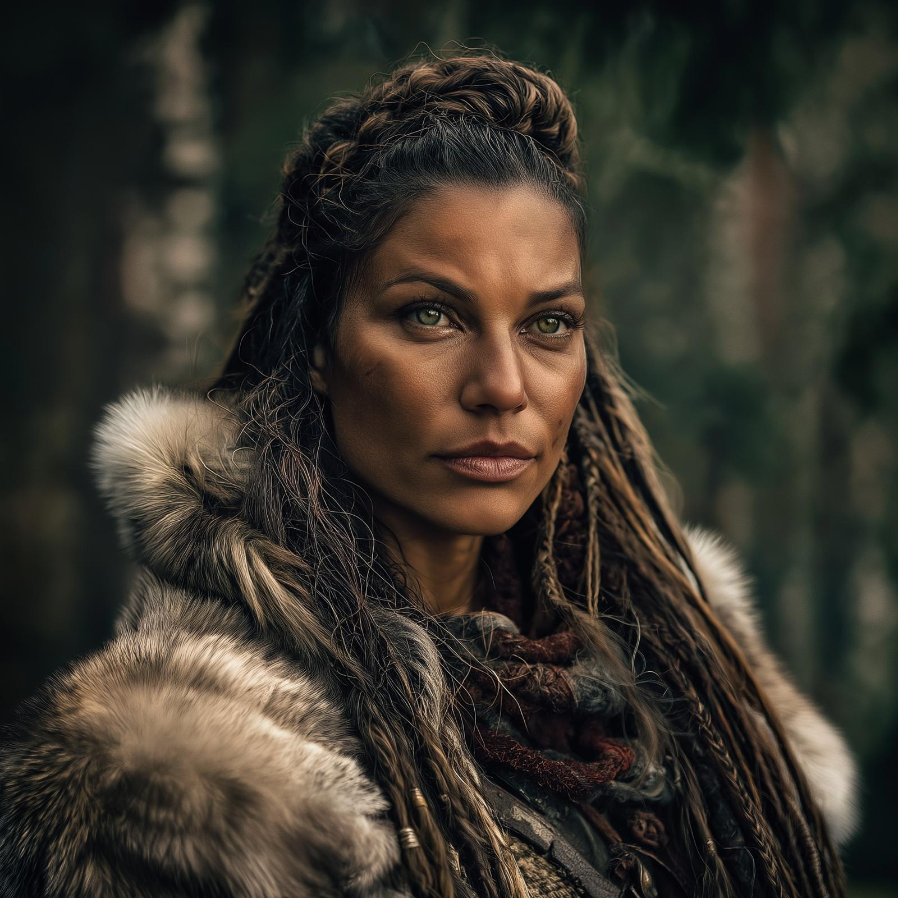

# Jotha
:speaker:{ .middle } *(yo-TAH)*  

- :octicons-info-24:{ .lg .middle } __Biographical Information__

    A Deno'qai [human](<../../species/humans.md>) (she/her)  
    Born DR 1719 (30 years old)  
    { .bio }

    Originally from: the [Ko'zula village](<../../gazetteer/central-highlands/ko-zula-village.md>), the [Forest of Dreams](<../../gazetteer/central-highlands/forest-of-dreams.md>), [Ainumarya](<../../gazetteer/central-highlands/ainumarya.md>)

:octicons-location-24:{ .lg .middle } Currently [Vindristjarna](<../../things/ships/vindristjarna.md>)

{align="right"; width="300"}Jotha is a warrior, serious and sometimes distant, who relies on her connection to the [Tanshi](<../../gods-and-religions/gods/tanshi/tanshi.md>) to make sense of the dangers and evils she has faced. She prefers to listen instead of talk, and enjoys hearing stories. While eventually she intends to return to her homeland, for now she travels seeking to deepen her connection to the tanshi. 
## Background
Jotha was born to the Ko'zula, one of the northern Deno'qai tribes. From a young age, she displayed a talent for the sword and spear, and seemed to have the favor of the [Tanshi](<../../gods-and-religions/gods/tanshi/tanshi.md>). She trained as a holy warrior, and for many years she served as a scout and defender of the villages of the Ko'zula on the slopes of the [Northern Sentinels](<../../gazetteer/northern-sentinels/northern-sentinels.md>). 

When she was 24, in DR 1743, an evil crept out of the [Forest of Nightmares](<../../gazetteer/northern-sentinels/forest-of-nightmares.md>): a deathless warlock commanding a small horde of undead. They attacked a hunting camp, and Jotha and many others went to its defense. During the battle, Jotha was badly wounded, struggling to contain the warlock, grappling him to allow others to finish him off, when she suddenly vanished. She does not speak much of her experience, but describes touching an [armband the deathless warlock carried](<../../campaigns/dunmari-frontier-campaign/treasure/cha-muttes-shadow-armband.md>), and feeling torn as if she were dying, and then opening her eyes in a vast strange forest. 

She spend the next several years among the Vargaldi, learning their language and customs, until joining the [Dunmar Fellowship](<../pcs/dunmar-fellowship/dunmar-fellowship.md>). 