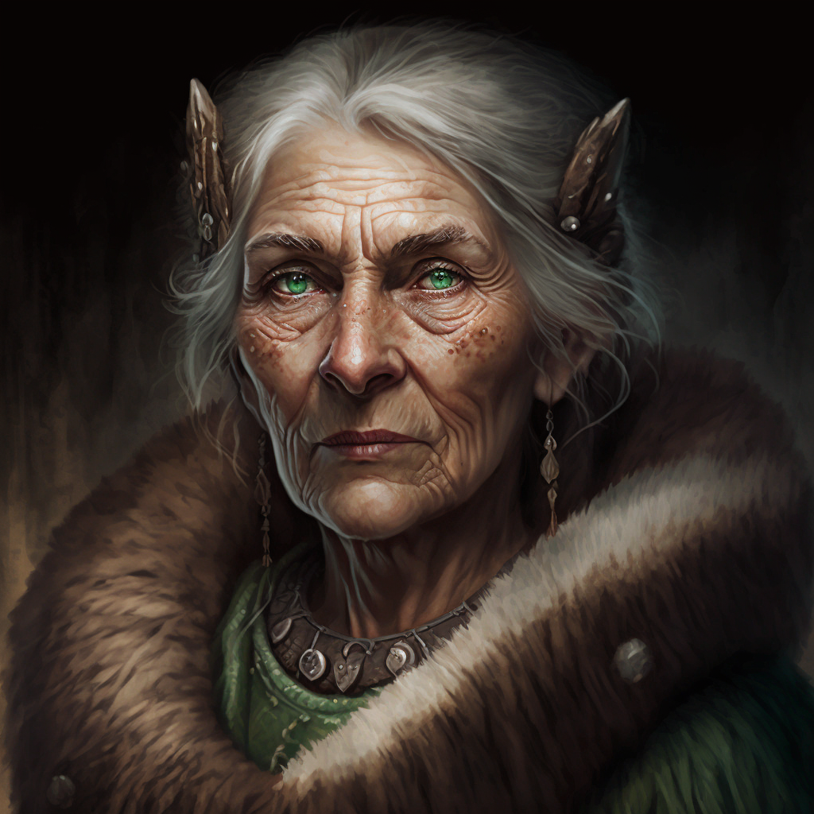

# Safri

- :octicons-info-24:{ .lg .middle } __Biographical Information__

    A Deno'qai [human](<../../species/humans/humans.md>) (she/her)  
    { .bio }

    Originally from: Unknown

:octicons-location-24:{ .lg .middle } Last known location (as of October 25th, 1748): the [Sentinel Range](<../../gazetteer/sentinel-range/sentinel-range.md>)

:octicons-location-24:{ .lg .middle } Visited by [Delwath](<../pcs/dunmar-fellowship/delwath.md>) on October 25th, 1748 in the forest valleys of the [Sentinel Range](<../../gazetteer/sentinel-range/sentinel-range.md>)  

{align="right"; width="320"}An old Deno'qai druid with many stories and rumors to her name. Many claim to have met her, but most speak of her in animal form, a deer that acts unusually intelligent and leads a lost traveler back to a path, or a hawk that drops a brace of rabbits on the camp of a hungry family who have had bad luck with the hunt.

The stories of Safri feel to [Delwath](<../pcs/dunmar-fellowship/delwath.md>) as he listens to them like folk tales. But you do meet a few people who have spoken to her. Those who have met her in human form describe a feeling as if the souls of animals gather to her: [A'gaza](<../../cosmology/gods/tanshi/a-gaza.md>), the tanshi of deer, reindeer, caribou; [Bita](<../../cosmology/gods/tanshi/bita.md>), the tanshi of bears; [Washi](<../../cosmology/gods/tanshi/washi.md>), the tanshi of the forest mice and squirrels who gather food for the long winters. And as people tell these tales, you feel the eyes of your lynx shield staring intently, and the vision of [Nisir](<../../cosmology/gods/tanshi/nisir.md>), the tanshi of the hawks and eagles pulling at you. Whatever else she may be, Safri is clearly favored by those tanshi that are connected to animals.
