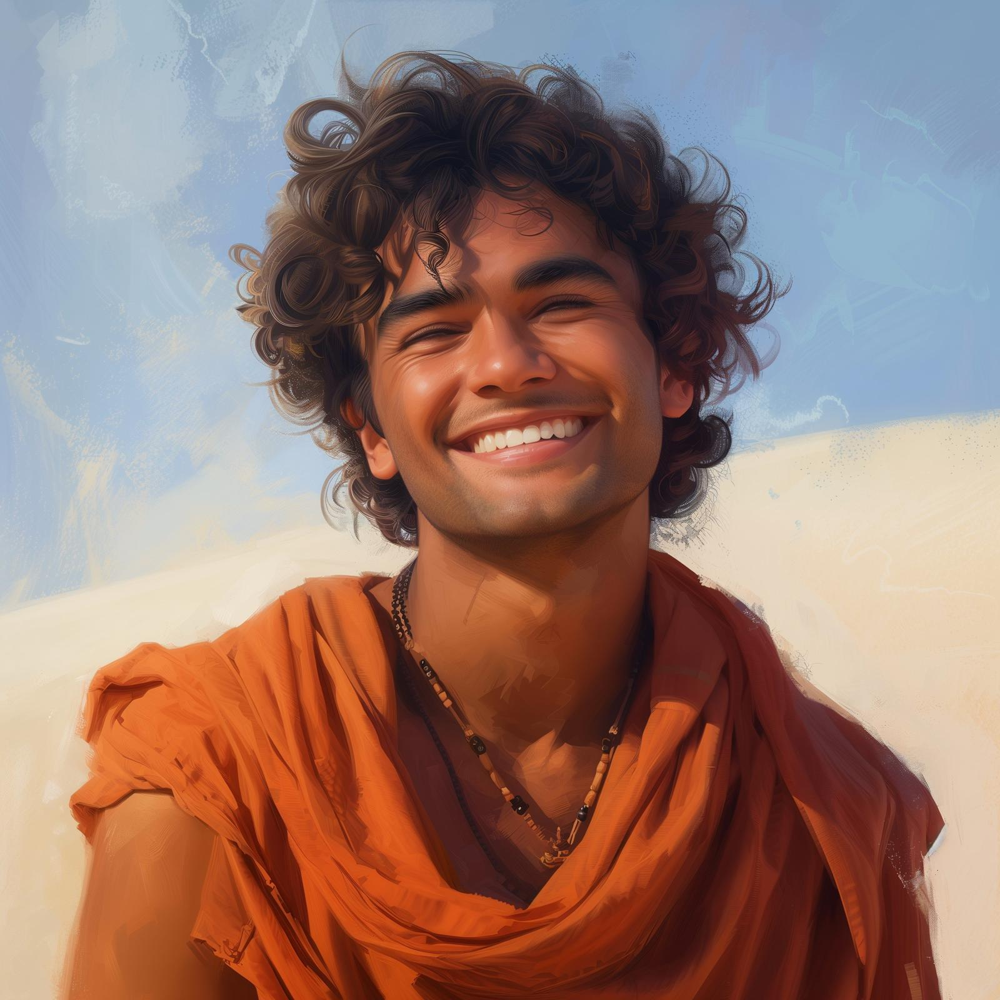
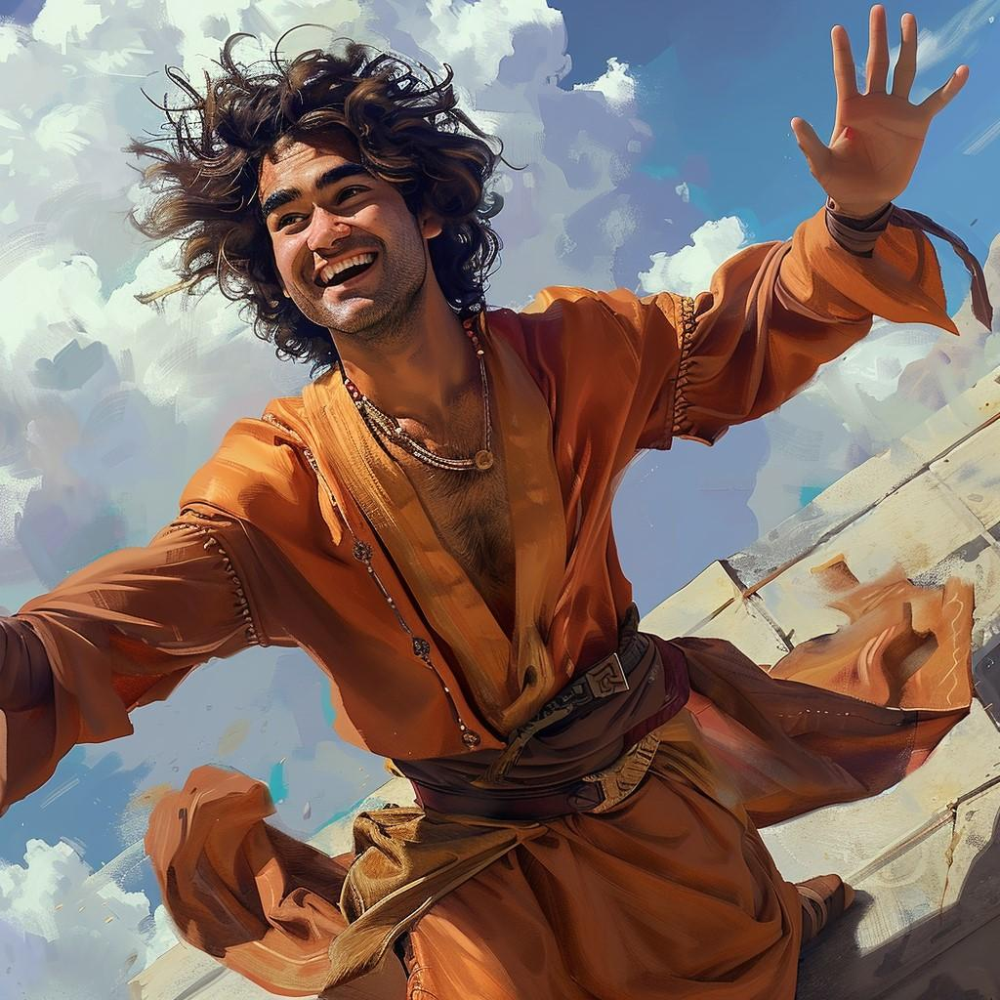
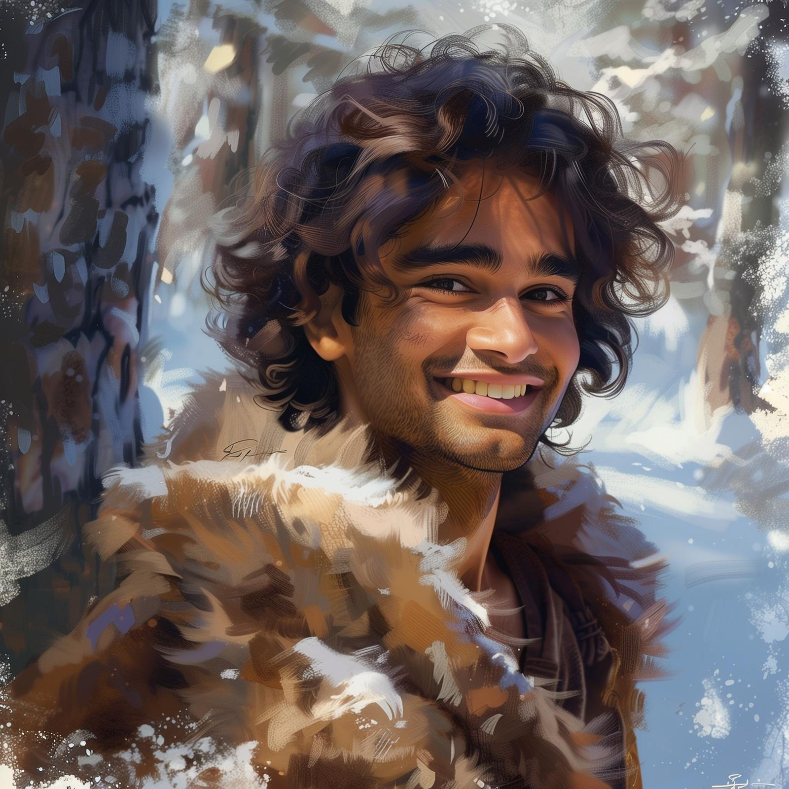
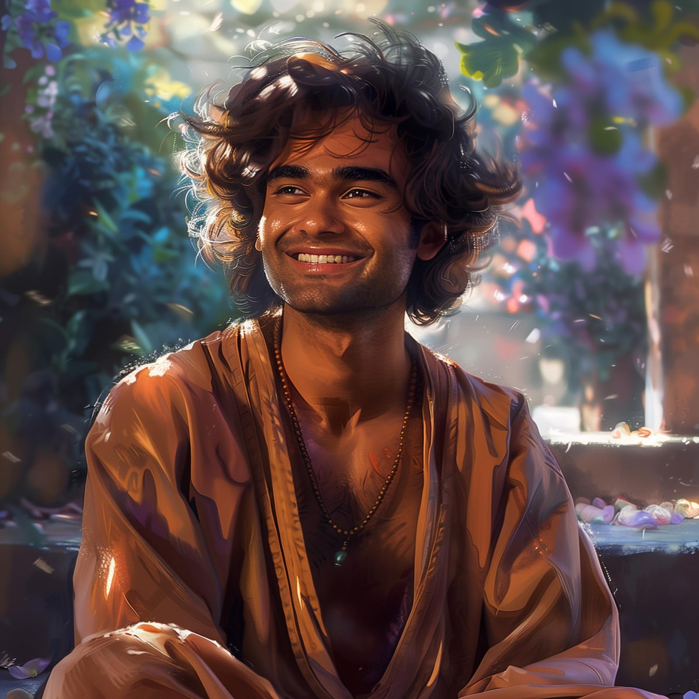

# Amil

- :octicons-info-24:{ .lg .middle } __Biographical Information__

    A [Dunmari](<../../gazetteer/greater-dunmar/realms/dunmar/dunmar.md>) [human](<../../species/humans.md>) (he/him)  
    Born DR 1731 (18 years old)  
    Member of the [Order of the Awakened Soul](<../../groups/dunmari-mystery-cults/order-of-the-awakened-soul.md>)  
    { .bio }

    Originally from: Unknown

:octicons-location-24:{ .lg .middle } Currently on [Vindristjarna](<../../things/ships/vindristjarna.md>), in the [Gulf of Chardon](<../../gazetteer/greater-chardon/gulf-of-chardon.md>), the [Endless Ocean](<../../gazetteer/endless-ocean.md>)

{align="right"; width="400"}A young monk, in training as an apprentice of the [Order of the Awakened Soul](<../../groups/dunmari-mystery-cults/order-of-the-awakened-soul.md>). Fit, tanned, and cheerful, even when undertaking challenging or unsettling tasks. Lives with his masters, [Pava](<./pava.md>) and [Avaras](<./avaras.md>), on the edge of the [Garamjala Desert](<../../gazetteer/drankorian-hinterland/garamjala-plateau/garamjala-desert.md>) in the blasted plains. 

## Events
- Apr 27, 1748 DR *(Amil)*: Arrives in Bas Udda to tend the unburied dead from the gnoll attacks
- Apr 29, 1748 DR *(Amil)*: Meets [Havdar](<./havdar.md>) and [Dunmar Fellowship](<../pcs/dunmar-fellowship/dunmar-fellowship.md>), who aid him in his task. 
- Apr 30, 1748 DR *(Amil)*: Leaves Bas Udda with The Dunmar Fellowship, traveling to his masters' house in the desert
- May 02, 1748 DR *(Amil)*: Arrives at Pava and Avaras' House with The Dunmar Fellowship. 
- May 17, 1748 DR *(Amil)*: At Pava and Avaras' House when [Dunmar Fellowship](<../pcs/dunmar-fellowship/dunmar-fellowship.md>) spend the night

## Gallery

