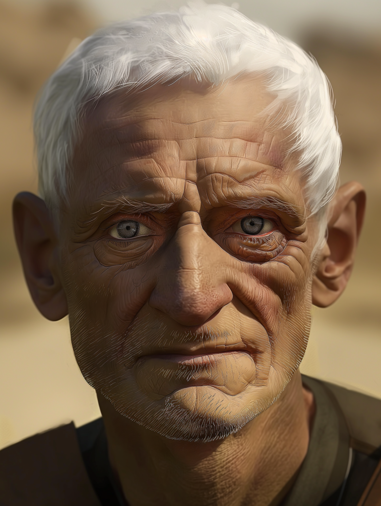

# Avaras

- :octicons-info-24:{ .lg .middle } __Biographical Information__

    A [Dunmari](<../../gazetteer/greater-dunmar/realms/dunmar/dunmar.md>) [human](<../../species/humans/humans.md>) (he/him)  
    Born DR 1676 (73 years old)  
    Member of the Order of the Awakened Soul  
    { .bio }

    Originally from: [Karawa](<../../gazetteer/greater-dunmar/realms/dunmar/eastern-dunmar/karawa.md>), [Eastern Dunmar](<../../gazetteer/greater-dunmar/realms/dunmar/eastern-dunmar/eastern-dunmar.md>), [Dunmar](<../../gazetteer/greater-dunmar/realms/dunmar/dunmar.md>)
    Based in [Pava and Avaras' House](<../../gazetteer/greater-dunmar/dunmari-basin/pava-and-avaras-house.md>), the [Garamjala Desert](<../../gazetteer/greater-dunmar/garamjala-plateau/garamjala-desert.md>)

Avaras is one of the few remaining masters of the Order of the Awakened Soul. He is an older man, with close cropped gray hair and lined, weathered skin. He lives in the [Garamjala Desert](<../../gazetteer/greater-dunmar/garamjala-plateau/garamjala-desert.md>) with his partner [Pava](<./pava.md>) and apprentice [Amil](<./amil.md>), leading an isolated existence, concerned with [Pava](<./pava.md>) and with what is left of the Order's mission. 

Avaras grew up on the plains near [Karawa](<../../gazetteer/greater-dunmar/realms/dunmar/eastern-dunmar/karawa.md>). He was a loner as a child, but drawn to the stories that the wandering monks of the Order of the Awakened Soul would tell, and drawn to the idea of gathering the history of the common people. 

### Life Events

* (DR:: 1693) Became an apprentice of the Order of the Awakened Soul at 17 and traveled around much of Eastern Dunmar 
* (DR:: 1711), when he went to the [Monastery of Bhishma](<../../gazetteer/greater-dunmar/dunmari-basin/monastery-of-bhishma.md>), met [Pava](<./pava.md>), and was raised out of his apprenticeship. 
* (DR:: 1717), after the Awakened Soul Disaster took up residence in the desert with [Pava](<./pava.md>), to watch the comings and goings on the plains and rescue the lost and the desperate who come seeking treasure, glory, or death in the desert. 

It is a quiet life, with time for contemplation. With [Pava](<./pava.md>) and the occasional apprentice, he has sought out the many stories of lives lived on these lands that are forgotten, and sought to quiet the restless and forgotten dead who died in the chaos of the Great War and the Blood Years with no one to mark their lives. 

### Recents Happenings
* (DR:: 1747-08-19) Avaras and Pava found an elf, Delwath, wandering confused in the desert west of Kharsan, dying of thirst and delirious. They took him in, and removed his armor which seemed to be smoking with some kind of shadows. 
* (DR:: 1747-08-21) Delwath left in the night a few days later. 
* (DR:: 1748-05-02) Delwath returns and [meets Avaras again](<../../campaigns/dunmari-frontier/session-notes/session-19-dufr.md>), with the [Dunmar Fellowship](<../pcs/dunmar-fellowship/dunmar-fellowship.md>)

