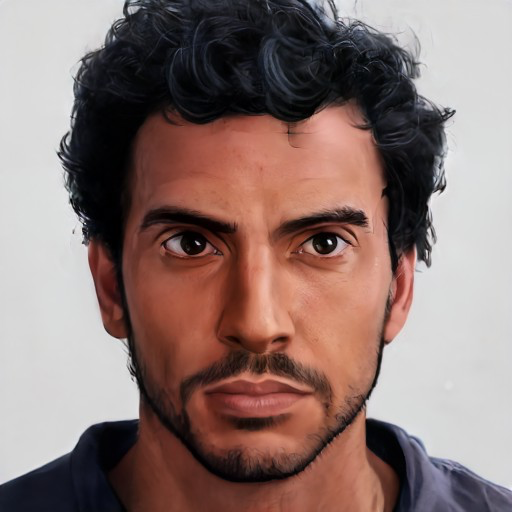

# Candrosa

- :octicons-info-24:{ .lg .middle } __Biographical Information__

    A [Dunmari](<../../gazetteer/greater-dunmar/realms/dunmar/dunmar.md>) [human](<../../species/humans/humans.md>) (he/him)  
    Born DR 1715 (34 years old)  
    Speaker of the [Shakun Mystai](<../../groups/dunmari-mystery-cults/shakun-mystai.md>)  
    { .bio }

    Based in [Karawa](<../../gazetteer/greater-dunmar/realms/dunmar/eastern-dunmar/karawa.md>), [Eastern Dunmar](<../../gazetteer/greater-dunmar/realms/dunmar/eastern-dunmar/eastern-dunmar.md>), [Dunmar](<../../gazetteer/greater-dunmar/realms/dunmar/dunmar.md>)

{align="right"; width="400"}The Speaker of the Mystai of Shakun, the public face of the Temple of Shakun, and the official leader of the Mystai.

