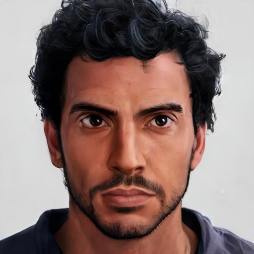

# Candrosa

- :octicons-info-24:{ .lg .middle } __Biographical Information__

    A [Dunmari](<../../gazetteer/greater-dunmar/realms/dunmar/dunmar.md>) [human](<../../creatures/species/humans.md>) (he/him)  
    Born DR 1715 (34 years old)  
    Speaker of the [Shakun Mystai](<../../groups/dunmari-mystery-cults/shakun-mystai.md>)  
    { .bio }

    Based in [Karawa](<../../gazetteer/greater-dunmar/realms/dunmar/eastern-dunmar/karawa.md>), [Eastern Dunmar](<../../gazetteer/greater-dunmar/realms/dunmar/eastern-dunmar/eastern-dunmar.md>), [Dunmar](<../../gazetteer/greater-dunmar/realms/dunmar/dunmar.md>)

:octicons-location-24:{ .lg .middle } Met by the [Dunmar Fellowship](<../pcs/dunmar-fellowship/dunmar-fellowship.md>) on March 22th, 1748 in [Karawa](<../../gazetteer/greater-dunmar/realms/dunmar/eastern-dunmar/karawa.md>), [Eastern Dunmar](<../../gazetteer/greater-dunmar/realms/dunmar/eastern-dunmar/eastern-dunmar.md>), [Dunmar](<../../gazetteer/greater-dunmar/realms/dunmar/dunmar.md>)  

:octicons-location-24:{ .lg .middle } The entrusted the [Dunmar Fellowship](<../pcs/dunmar-fellowship/dunmar-fellowship.md>) with recovering the [Heart of Shakun](<../../things/artifacts-of-power/heart-of-shakun.md>) by the [Dunmar Fellowship](<../pcs/dunmar-fellowship/dunmar-fellowship.md>) on May 23th, 1748 in [Karawa](<../../gazetteer/greater-dunmar/realms/dunmar/eastern-dunmar/karawa.md>), [Eastern Dunmar](<../../gazetteer/greater-dunmar/realms/dunmar/eastern-dunmar/eastern-dunmar.md>), [Dunmar](<../../gazetteer/greater-dunmar/realms/dunmar/dunmar.md>)  

:octicons-location-24:{ .lg .middle } Last seen by the [Dunmar Fellowship](<../pcs/dunmar-fellowship/dunmar-fellowship.md>) on June 19th, 1748 in [Karawa](<../../gazetteer/greater-dunmar/realms/dunmar/eastern-dunmar/karawa.md>), [Eastern Dunmar](<../../gazetteer/greater-dunmar/realms/dunmar/eastern-dunmar/eastern-dunmar.md>), [Dunmar](<../../gazetteer/greater-dunmar/realms/dunmar/dunmar.md>)  

{align="right"; width="400"}
Candrosa serves as Speaker of the [Shakun Mystai](<../../groups/dunmari-mystery-cults/shakun-mystai.md>), acting as high priest, civic voice, and guardian of [Karawa](<../../gazetteer/greater-dunmar/realms/dunmar/eastern-dunmar/karawa.md>)’s mesa-top temple. He balances political diplomacy with the desperate work of keeping [Shakun's Protection](<../../gods-and-religions/religions/five-siblings/shakun-s-protection.md>) functioning while the borderlands reel from gnoll incursions and otherworldly threats.

## Overview
- Oversees rites, initiations, and the weaving of dream-visions that guide mystai acolytes and border sentinels.  
- Coordinates with Elder Kisa, [Havdar](<./havdar.md>), and visiting leaders to align temple magic with the town’s survival needs.  
- Wields the [Dreamweaver Staff](<../../things/artifacts-of-power/dreamweaver-staff.md>), channeling dreams to scout echo realms, inspire allies, and—when his judgment falters—nudge companions toward actions he feels the goddess demands.

## Personality & Outlook
Pragmatic yet devout, Candrosa carries the weight of Karawa’s safety on little sleep. He is proudly Dunmari and protective of temple secrets, second-guessing himself whenever his caution endangers others. The loss of the [Heart of Shakun](<../../things/artifacts-of-power/heart-of-shakun.md>) exposed a streak of desperate improvisation: he will risk trust, even manipulating visions (as with [Delwath](<../pcs/dunmar-fellowship/delwath.md>) in [Session 26 (DuFr)](<../../campaigns/dunmari-frontier-campaign/session-notes/session-26-dufr.md>)) if the alternative is watching the mesa crumble. Since the Heart’s recovery he is humbler, quicker to confer with the [Dunmar Fellowship](<../pcs/dunmar-fellowship/dunmar-fellowship.md>), and intent on rebuilding a wider circle of initiates.

## Role in Recent Events
- **Hyena Rampage (Session 1):** Called on the newly formed Fellowship after the hyena assault, granting them authority to investigate and defend Karawa.  
- **Festival Crisis (Sessions 4–6):** Confided that Shakun’s wards were failing, convened the April 4th council, and chose to remain in the temple when most townsfolk fled.  
- **Siege & Aftermath (Sessions 17–19):** Endured the gnoll siege, coordinated relief with [Tharandros](<../other-nonhumans/tharandros.md>) and [Havdar](<./havdar.md>), and safeguarded party treasures while new sorties probed the desert.  
- **Heart of Shakun Quest (Sessions 26–29):** Admitted to steering Delwath’s visions, revealed [Cintra](<./cintra.md>)’s disappearance with the Heart, and empowered the Fellowship with an abbreviated initiation plus a scroll of sending for the rescue mission.  
- **Restored Web (Session 32):** Led funerary rites for fallen mystai, resumed full initiations once Cintra returned, and orchestrated the [Feast of Bhishma](<../../gods-and-religions/holidays-and-festivals/dunmari-festivals/feast-of-bhishma.md>) as a public renewal of Shakun’s covenant.

## Relationships & Resources
- **[Cintra](<./cintra.md>) & [Jumi](<./jumi.md>):** Reveres the Supreme Oracle and her daughter; their absence forced him into reluctant command, and he now defers to Cintra on strategic uses of the restored Heart.  
- **[Dunmar Fellowship](<../pcs/dunmar-fellowship/dunmar-fellowship.md>):** Relies on their broad reach—dream-walks with them via the staff, hides contraband relics for their expeditions, and trusts them to speak truths he cannot reveal publicly.  
- **[Havdar](<./havdar.md>) & town elders:** Acts as moral authority within councils, tempering Havdar’s militancy with long-term spiritual stewardship.  
- **[Tharandros](<../other-nonhumans/tharandros.md>)’ herd:** Maintains a fragile alliance forged through shared defense of the land’s vitality; he keeps the secret of the Heart’s web to a narrow list that now includes the centaur chieftain.  
- **Mystai Initiates:** Mentors acolytes like [Alesh](<./alesh.md>) and, more recently, [Drikod](<../pcs/dunmar-fellowship/guests/drikod.md>) and [Kenzo](<../pcs/dunmar-fellowship/kenzo.md>), tying their memories into the lattice that powers the mesa wards.

## Timeline Highlights
- **1748-03-22:** Summons the party after the hyena raid and begins sharing intelligence on border attacks ([Session 1 (DuFr)](<../../campaigns/dunmari-frontier-campaign/session-notes/session-1-dufr.md>)).  
- **1748-04-04:** Oversees the evacuation council and pledges to defend the temple when the populace flees west ([Session 5 (DuFr)](<../../campaigns/dunmari-frontier-campaign/session-notes/session-5-dufr.md>), [Session 6 (DuFr)](<../../campaigns/dunmari-frontier-campaign/session-notes/session-6-dufr.md>)).  
- **1748-04-24:** Briefs the Fellowship on gnoll movements, demonic rumors, and the taboo topic of Shakun’s waning protection ([Session 18 (DuFr)](<../../campaigns/dunmari-frontier-campaign/session-notes/session-18-dufr.md>)).  
- **1748-05-23:** Confesses the Heart’s absence, shares the truth of the initiation network, and equips the party for the Wellspring mission ([Session 26 (DuFr)](<../../campaigns/dunmari-frontier-campaign/session-notes/session-26-dufr.md>)).  
- **1748-06-01:** Welcomes the Heart back to Karawa and begins coordinating the rebuilding of the warding web ([Session 29 (DuFr)](<../../campaigns/dunmari-frontier-campaign/session-notes/session-29-dufr.md>)).  
- **1748-06-18:** Guides the Feast of Bhishma, publicly backing [Nayan Sura](<./sura.md>)’s push to rally Dunmari forces while quietly tasking the Fellowship with the next leg toward [Tokra](<../../gazetteer/greater-dunmar/realms/dunmar/central-dunmar/tokra/tokra.md>) ([Session 32 (DuFr)](<../../campaigns/dunmari-frontier-campaign/session-notes/session-32-dufr.md>)).  

## Story Hooks
- Seek his dream-guided insight on lingering traces of [Agata](<../fey/agata.md>)’s curses or on the Chardonian expeditions skirting Dunmar’s borders.  
- Broker dialogue between Candrosa and skeptical allies (such as [Tharandros](<../other-nonhumans/tharandros.md>) or Tokran officials) to widen the network powering Shakun’s wards.  
- Investigate whether Candrosa can safely replicate the emergency initiation that gave the Fellowship partial access to the Heart’s lattice—he fears both the cost and the necessity.  
- Unearth the limits of the Dreamweaver Staff: Candrosa suspects its prior owners left safeguards that a skilled artificer could reactivate, strengthening his ability to watch the echo realms.
