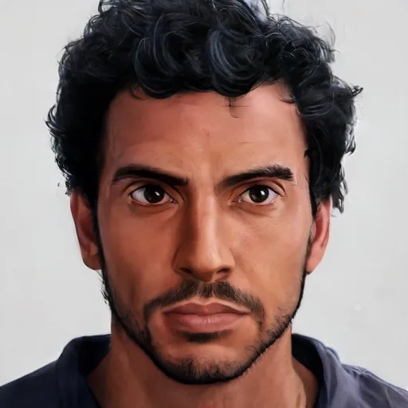

# Candrosa

- :octicons-info-24:{ .lg .middle } __Biographical Information__

    A [Dunmari](<../../gazetteer/greater-dunmar/realms/dunmar/dunmar.md>) [human](<../../creatures/species/humans.md>) (he/him)  
    Born DR 1715 (35 years old)  
    Speaker of the [Shakun Mystai](<../../groups/dunmari-mystery-cults/shakun-mystai.md>)  
    { .bio }

    Based in [Karawa](<../../gazetteer/greater-dunmar/realms/dunmar/eastern-dunmar/karawa.md>), [Dunmar](<../../gazetteer/greater-dunmar/realms/dunmar/dunmar.md>)

:octicons-location-24:{ .lg .middle } Met by the [Dunmar Fellowship](<../pcs/dunmar-fellowship/dunmar-fellowship.md>) on March 22th, 1748 in [Karawa](<../../gazetteer/greater-dunmar/realms/dunmar/eastern-dunmar/karawa.md>), [Dunmar](<../../gazetteer/greater-dunmar/realms/dunmar/dunmar.md>)  

:octicons-location-24:{ .lg .middle } Entrusted the [Dunmar Fellowship](<../pcs/dunmar-fellowship/dunmar-fellowship.md>) with recovering the [Heart of Shakun](<../../things/artifacts-of-power/heart-of-shakun.md>) on May 23th, 1748 in [Karawa](<../../gazetteer/greater-dunmar/realms/dunmar/eastern-dunmar/karawa.md>)  

:octicons-location-24:{ .lg .middle } Last seen by the [Dunmar Fellowship](<../pcs/dunmar-fellowship/dunmar-fellowship.md>) on June 19th, 1748 in [Karawa](<../../gazetteer/greater-dunmar/realms/dunmar/eastern-dunmar/karawa.md>), [Dunmar](<../../gazetteer/greater-dunmar/realms/dunmar/dunmar.md>)  

{align="right"; width="400"}Candrosa serves as Speaker of the [Shakun Mystai](<../../groups/dunmari-mystery-cults/shakun-mystai.md>), acting as the leader of the [Temple of Shakun](<../../gazetteer/greater-dunmar/realms/dunmar/eastern-dunmar/temple-of-shakun.md>) in [Karawa](<../../gazetteer/greater-dunmar/realms/dunmar/eastern-dunmar/karawa.md>) and the public face of the mystai. He oversees rites, initiations, and dream-visions; and serves as a councilor to the temple hierarchy in Karawa. 
## Personality & Outlook
Candrosa is proudly Dunmari and protective of temple secrets, second-guessing himself whenever his caution endangers others. He is at is best preaching to a crowd, but doubts himself when forced to make strategic decisions, especially concerning the [magical protections of Shakun](<../../gods-and-religions/religions/five-siblings/shakun-s-protection.md>).

The loss of the [Heart of Shakun](<../../things/artifacts-of-power/heart-of-shakun.md>) exposed a streak of desperate improvisation: he will risk trust, even [manipulating visions](<../../campaigns/dunmari-frontier-campaign/session-notes/session-26-dufr.md>) if the alternative is watching the mesa crumble. Since the Heart’s recovery he is humbler, quicker to confer with allies, and intent on rebuilding a wider circle of initiates.

