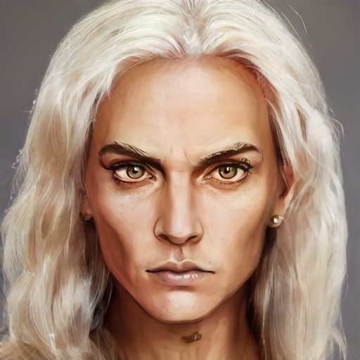

# Cintra

- :octicons-info-24:{ .lg .middle } __Biographical Information__

    A [Dunmari](<../../gazetteer/greater-dunmar/realms/dunmar/dunmar.md>) [human](<../../species/children-of-divine-creation/humans/humans.md>) (she/her)  
    Born DR 1705 (44 years old)  
    Member of the [Shakun Mystai](<../../groups/dunmari-mystery-cults/shakun-mystai.md>)  
    { .bio }

    Based in [Karawa](<../../gazetteer/greater-dunmar/realms/dunmar/eastern-dunmar/karawa.md>), [Eastern Dunmar](<../../gazetteer/greater-dunmar/realms/dunmar/eastern-dunmar/eastern-dunmar.md>), [Dunmar](<../../gazetteer/greater-dunmar/realms/dunmar/dunmar.md>)

Supreme Oracle of Shakun.

