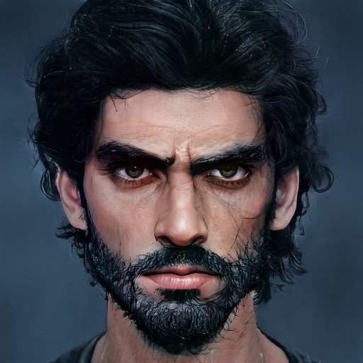

# Havdar

- :octicons-info-24:{ .lg .middle } __Biographical Information__

    A [Dunmari](<../../gazetteer/greater-dunmar/realms/dunmar/dunmar.md>) [human](<../../species/humans/humans.md>) (he/him)  
    Born DR 1724 (25 years old)  
    Commander of Havdar's Warband  
    { .bio }

    Originally from: [Karawa](<../../gazetteer/greater-dunmar/realms/dunmar/eastern-dunmar/karawa.md>), [Eastern Dunmar](<../../gazetteer/greater-dunmar/realms/dunmar/eastern-dunmar/eastern-dunmar.md>), [Dunmar](<../../gazetteer/greater-dunmar/realms/dunmar/dunmar.md>)
    Based in [Eastern Dunmar](<../../gazetteer/greater-dunmar/realms/dunmar/eastern-dunmar/eastern-dunmar.md>), [Dunmar](<../../gazetteer/greater-dunmar/realms/dunmar/dunmar.md>)

:octicons-location-24:{ .lg .middle } Scryed by [Delwath](<../pcs/dunmar-fellowship/delwath.md>) in [Songara](<../../gazetteer/greater-dunmar/realms/dunmar/central-dunmar/songara.md>), [Dunmar](<../../gazetteer/greater-dunmar/realms/dunmar/dunmar.md>), on December 27th, 1748  

Havdar, a brash and confident warrior, made a name for himself as a war leader in [Eastern Dunmar](<../../gazetteer/greater-dunmar/realms/dunmar/eastern-dunmar/eastern-dunmar.md>), before joining with Nayan [Sura](<./sura.md>) in support of her claim to the leadership of the Dunmari people. 
## Overview

Havdar was born outside [Karawa](<../../gazetteer/greater-dunmar/realms/dunmar/eastern-dunmar/karawa.md>), and grew up herding goats amongst the rough, rocky deserts and scrublands of [Eastern Dunmar](<../../gazetteer/greater-dunmar/realms/dunmar/eastern-dunmar/eastern-dunmar.md>). Always passionate about the traditions of the Dunmari, he is dedicated to his homeland and [Eastern Dunmar](<../../gazetteer/greater-dunmar/realms/dunmar/eastern-dunmar/eastern-dunmar.md>), and the traditions of his people, and skeptical of the city folk to the west and especially the Samraat. Blessed with natural strength and dexterity, Havdar gathered a small group of dedicated warriors around him, and became know as something of a protector of [Eastern Dunmar](<../../gazetteer/greater-dunmar/realms/dunmar/eastern-dunmar/eastern-dunmar.md>). He often speaks reverently about the [Red Mesa](<../../gazetteer/greater-dunmar/realms/dunmar/eastern-dunmar/red-mesa.md>), the [Gomat](<../../gazetteer/greater-dunmar/dunmari-basin/gomat.md>) Oasis, and other landmarks of the eastern plains. 

In the summer of DR 1748, he took on a pivotal role as the chief general to Nayan [Sura](<./sura.md>), standing steadfastly by her side as she asserts her claim to the Dunmari throne.
## Description

Havdar is tall, imposing, and rugged, shaped by the relentless sun and winds of the Dunmari plains. He has dark, tangled hair and short, scrubby beard. He is usually wearing armor and carrying his spear.

{width="500"}
## Relationships

- Nayan [Sura](<./sura.md>): As her chief general and most trusted advisor, Havdar is unwavering in his loyalty to Nayan [Sura](<./sura.md>). Their bond is strong, and he's fully committed to supporting her claim against her brother, even if it leads to civil war. Havdar first met her when she traveled in the east when he was young, and as a teenager was devastated by the news of her disappearance. He considers her rescue and reappearance a blessing from the gods. 
- [Nayan Karnas](<./nayan-karnas.md>): Havdar is disdainful of [Nayan Karnas](<./nayan-karnas.md>), feeling him a weak ruler who has abandoned the traditions that made [Dunmar](<../../gazetteer/greater-dunmar/realms/dunmar/dunmar.md>) great. Has often pushed for war, thinking Karnas will be unable to command the loyalty of enough warriors to fight back. 
- Havdar's Warband: Originally a close-knit group, they have grown under Havdar's leadership into a force that stands against threats from the [Nashtkar](<../../gazetteer/greater-dunmar/dunmari-basin/nashtkar.md>) and elsewhere. Havdar's troops now serve as elite warriors in [Sura](<./sura.md>)'s service. People in Havdar's band include [Aram](<./aram.md>) and [Camana](<./camana.md>) (deceased). 
- [Dunmar Fellowship](<../pcs/dunmar-fellowship/dunmar-fellowship.md>): Initially indifferent, perhaps even skeptical, of the [Dunmar Fellowship](<../pcs/dunmar-fellowship/dunmar-fellowship.md>), grew to respect and greatly value them over the course of a month traveling in the eastern deserts together, during which [Dunmar Fellowship](<../pcs/dunmar-fellowship/dunmar-fellowship.md>) [helped defend his camp from orc attackers](<../../campaigns/dunmari-frontier/session-notes/session-20-dufr.md>). 
## Events

- In March/April 1748, was heavily involved in defending [Karawa](<../../gazetteer/greater-dunmar/realms/dunmar/eastern-dunmar/karawa.md>) from gnoll attacks. 
- In April/May 1748, scouted the eastern deserts with [Dunmar Fellowship](<../pcs/dunmar-fellowship/dunmar-fellowship.md>)
- In August 1748, was petrified by a cursed sword taken from [Agata's lair](<../../gazetteer/greater-dunmar/dunmari-basin/agata-s-lair.md>), gifted to him by [Dunmar Fellowship](<../pcs/dunmar-fellowship/dunmar-fellowship.md>), who were unaware it was cursed.
- In September 1748, was restored, but became increasingly paranoid as the subtle curse of the sword still worked its evil magic. 
- In November 1748, the curse was broken by [Riswynn](<../pcs/dunmar-fellowship/riswynn.md>)'s prayers, and the cursed sword destroyed by the [Bahrazel](<../../cosmology/gods/embodied-gods/bahrazel.md>), freeing Havdar of its evil influence. 
- In December 1748, led [Sura](<./sura.md>)'s army in the [Battle of Tokra](<../../events/1700s/1748/12/battle-of-tokra.md>). 
## Rumors and Information

- Havdar was a major proponent of war with [Nayan Karnas](<./nayan-karnas.md>), but whether this was the result of the curse of the sword, or his own opinion, is hard to know. 
- While cursed, became increasingly paranoid, seeing threats in everything.

