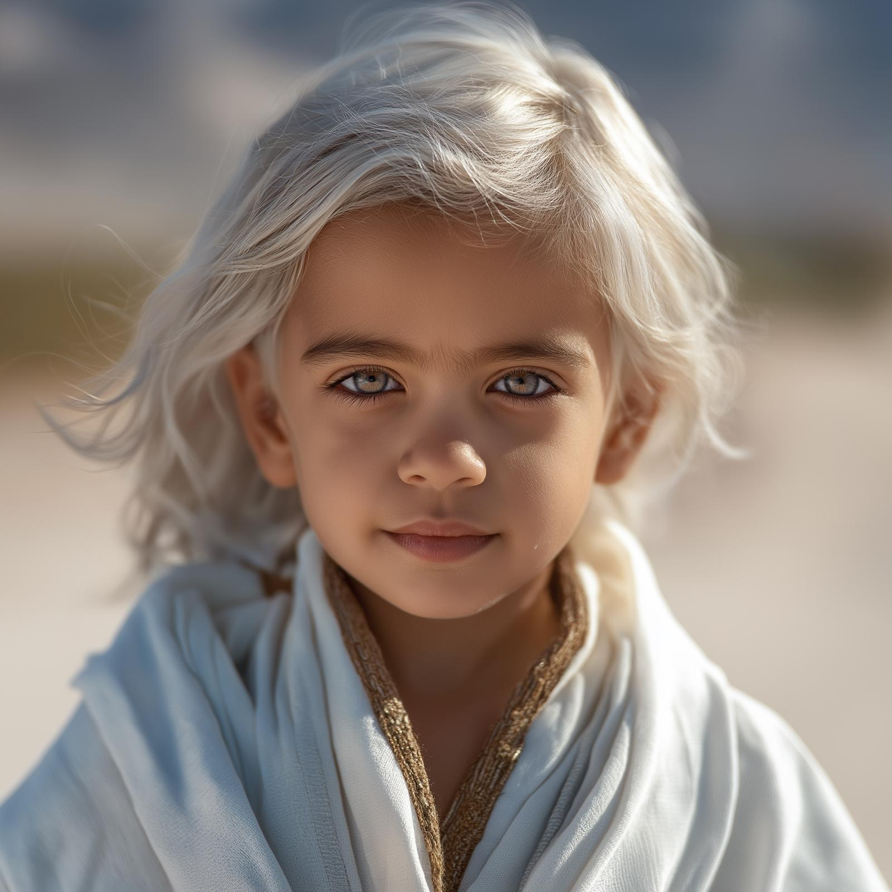

# Jumi

- :octicons-info-24:{ .lg .middle } __Biographical Information__

    A [Dunmari](<../../gazetteer/greater-dunmar/realms/dunmar/dunmar.md>) [human](<../../creatures/species/humans.md>) (she/her)  
    Born December 28th, 1745 (4 years old)  
    { .bio }

    Based in [Karawa](<../../gazetteer/greater-dunmar/realms/dunmar/eastern-dunmar/karawa.md>), [Dunmar](<../../gazetteer/greater-dunmar/realms/dunmar/dunmar.md>)

{align="right"; width="300"}[Cintra](<cintra.md>)'s young daughter, and a magical prodigy, blessed by the spirit of [Shakun](<../../gods-and-religions/gods/incorporeal-gods/dunmari-pantheon/shakun.md>). 

