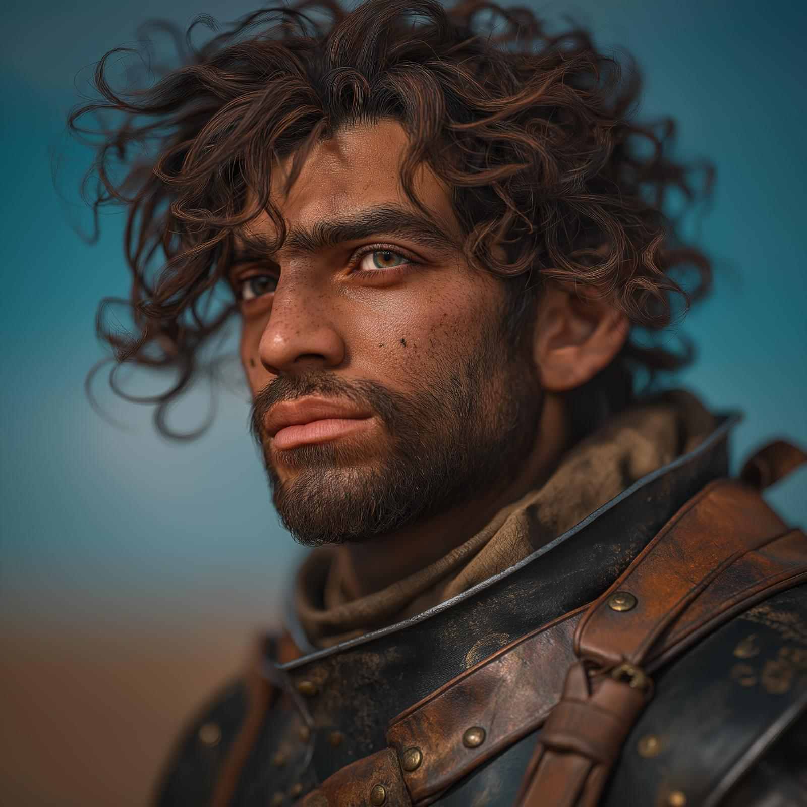

# Justan

- :octicons-info-24:{ .lg .middle } __Biographical Information__

    A [Dunmari](<../../gazetteer/greater-dunmar/realms/dunmar/dunmar.md>) [human](<../../species/humans.md>) (he/him)  
    b. DR 1723 - d. July 23th, 1748, killed by [Casian](<../chardonians/casian.md>) at age 25 years  
    { .bio }

    Lived on the [~North Tokra Plains~](<../../gazetteer/greater-dunmar/dunmari-basin/north-tokra-plains.md>), in [Dunmar](<../../gazetteer/greater-dunmar/realms/dunmar/dunmar.md>)

:octicons-location-24:{ .lg .middle } Killed by [Casian](<../chardonians/casian.md>) in the [Copper Hills](<../../gazetteer/greater-dunmar/darba-highlands/copper-hills.md>), [Dunmar](<../../gazetteer/greater-dunmar/realms/dunmar/dunmar.md>)

:octicons-location-24:{ .lg .middle } Met by the [Dunmar Fellowship](<../pcs/dunmar-fellowship/dunmar-fellowship.md>) on July 21th, 1748 in the [Copper Hills](<../../gazetteer/greater-dunmar/darba-highlands/copper-hills.md>), [Dunmar](<../../gazetteer/greater-dunmar/realms/dunmar/dunmar.md>)  

{align="right"; width="250"}A Dunmari man, from a family of horse herders traveling on the lands around [Tokra](<../../gazetteer/greater-dunmar/realms/dunmar/central-dunmar/tokra/tokra.md>). 

In the spring of 1748, his family lost much of their wealth from famine and disease, associated with the Tokra refugee crisis caused by the Summer Gnoll Raids of 1748. He left his home and joined with a group of other disillusioned and unsavory Dunmari in the [Copper Hills](<../../gazetteer/greater-dunmar/darba-highlands/copper-hills.md>), and began raiding travelers on the Tokra-Darba road. On July 21, 1748, encountered [Dunmar Fellowship](<../pcs/dunmar-fellowship/dunmar-fellowship.md>) and was intimidated into joining them to fight the rumored dragon (actually wyverns) on the road by [Delwath](<../pcs/dunmar-fellowship/delwath.md>). Survived the wyvern battle only to be killed by [Casian](<../chardonians/casian.md>)'s fireball on July 23rd, 1748. 

His story was heard by [Kenzo](<../pcs/dunmar-fellowship/kenzo.md>) and collected for the [Order of the Awakened Soul](<../../groups/dunmari-mystery-cults/order-of-the-awakened-soul.md>): [Justan's Story](<../../campaigns/dunmari-frontier-campaign/collected-stories/justan-s-story.md>).
