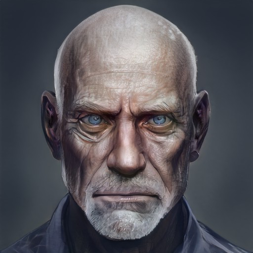

# Pava

- :octicons-info-24:{ .lg .middle } __Biographical Information__

    { .bio }

A master of the Order of the Awakened Soul, an old man, bald, with striking blue eyes and surprising agility.

{width="500"}

