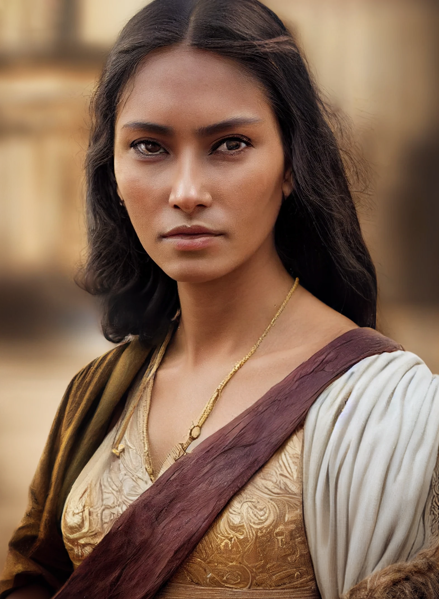

# Nayan Sura

- :octicons-info-24:{ .lg .middle } __Biographical Information__

    A [Dunmari](<../../gazetteer/greater-dunmar/realms/dunmar/dunmar.md>) [human](<../../species/humans.md>) (she/her), of the [Nayan dynasty](<../../groups/dunmari-dynasties/nayan-dynasty.md>)  
    Born DR 1720 (29 years old)  
    Samraat of [Eastern Dunmar](<../../gazetteer/greater-dunmar/realms/dunmar/eastern-dunmar/eastern-dunmar.md>) (since July 22th, 1748)  
    { .bio }

    Originally from: [Darba](<../../gazetteer/greater-dunmar/realms/dunmar/coastal-dunmar/darba/darba.md>), [Dunmar](<../../gazetteer/greater-dunmar/realms/dunmar/dunmar.md>)

:octicons-location-24:{ .lg .middle } Last known location (as of December 26th, 1748): the [plains south of Tokra](<../../gazetteer/greater-dunmar/dunmari-basin/southern-tokra-plains.md>), [Dunmar](<../../gazetteer/greater-dunmar/realms/dunmar/dunmar.md>)

:octicons-location-24:{ .lg .middle } Scryed by the [Dunmar Fellowship](<../pcs/dunmar-fellowship/dunmar-fellowship.md>) on December 26th, 1748 on the [plains south of Tokra](<../../gazetteer/greater-dunmar/dunmari-basin/southern-tokra-plains.md>), in [Dunmar](<../../gazetteer/greater-dunmar/realms/dunmar/dunmar.md>)  

Nayan Sura is the younger sister of Samraat [Nayan Karnas](<./nayan-karnas.md>). Once seen as a future Samraat and a unifier of [eastern](<../../gazetteer/greater-dunmar/realms/dunmar/eastern-dunmar/eastern-dunmar.md>) and [Western Dunmar](<../../gazetteer/greater-dunmar/realms/dunmar/western-dunmar/western-dunmar.md>), she vanished eight years ago, trapped by [Agata](<../fey/agata.md>) Dustmother in the [Mirror of Soul Trapping](<../../campaigns/dunmari-frontier-campaign/treasure/mirror-of-soul-trapping.md>). In her absence, her brother, [Nayan Karnas](<./nayan-karnas.md>), claimed the throne of [Dunmar](<../../gazetteer/greater-dunmar/realms/dunmar/dunmar.md>). In DR 1748, Nayan Sura was freed from [Agata](<../fey/agata.md>)'s imprisonment, and now seeks to reclaim her destiny. 
## Overview

Sura was born in [Darba](<../../gazetteer/greater-dunmar/realms/dunmar/coastal-dunmar/darba/darba.md>), but traveled widely in her youth, including spending several years at the [Lakan Monastery](<../../gazetteer/greater-dunmar/realms/dunmar/central-dunmar/tokra/lakan-monastery.md>) in [Tokra](<../../gazetteer/greater-dunmar/realms/dunmar/central-dunmar/tokra/tokra.md>). From a young age, she was seen as god-touched, and perceived as a potential heir to the Dunmari throne, one who could unite the eastern and western factions of the divided country. Her future was cut short in DR 1740, when she was just 20 years old: she was trapped by [Agata](<../fey/agata.md>) Dustmother in the [Mirror of Soul Trapping](<../../campaigns/dunmari-frontier-campaign/treasure/mirror-of-soul-trapping.md>), and vanished. In DR 1748, she was freed by [Dunmar Fellowship](<../pcs/dunmar-fellowship/dunmar-fellowship.md>), and began to contemplate reclaiming the throne, especially in light of her perception that Karnas had neglected the east, most notably in his decision to leave the eastern nomads to their fate during the Summer Gnoll Raids of 1748. In December of DR 1748, she defeated a small force of Karnas' warriors and their Chardonian allies in the [Battle of Tokra](<../../events/1700s/1748/12/battle-of-tokra.md>), laying claim to central and [Eastern Dunmar](<../../gazetteer/greater-dunmar/realms/dunmar/eastern-dunmar/eastern-dunmar.md>). 
## Description

Sura is a tall, striking Dunmari woman, with high cheekbones, light brown skin, medium length dark hair, and a regal bearing. 
## Events

- Spent two years learning under the guidance of the [Lakan Mystai](<../../groups/dunmari-mystery-cults/lakan-mystai.md>) at the monastery outside [Tokra](<../../gazetteer/greater-dunmar/realms/dunmar/central-dunmar/tokra/tokra.md>), from DR 1735 - DR 1737. 
- Traversed across [Eastern Dunmar](<../../gazetteer/greater-dunmar/realms/dunmar/eastern-dunmar/eastern-dunmar.md>) in DR 1740 with the then Samraat, Nayan Marathu, as part of a great census of all [Dunmar](<../../gazetteer/greater-dunmar/realms/dunmar/dunmar.md>), the first census to travel east in many years. Between [Bas Udda](<../../gazetteer/greater-dunmar/realms/dunmar/eastern-dunmar/bas-udda.md>) and [Askandi](<../../gazetteer/greater-dunmar/realms/dunmar/central-dunmar/askandi.md>), she was kidnapped by [Agata](<../fey/agata.md>)'s servants - lured out of her tent by a magically disguised [orc](<../../species/orcs.md>) and then knocked unconscious and brought to [Agata's Lair](<../../gazetteer/greater-dunmar/dunmari-basin/agata-s-lair.md>) by [Samerki](<../other-nonhumans/samerki.md>), where she was imprisoned in the [Mirror of Soul Trapping](<../../campaigns/dunmari-frontier-campaign/treasure/mirror-of-soul-trapping.md>). 
- Freed from the [Mirror of Soul Trapping](<../../campaigns/dunmari-frontier-campaign/treasure/mirror-of-soul-trapping.md>) by [Dunmar Fellowship](<../pcs/dunmar-fellowship/dunmar-fellowship.md>) in the summer of DR 1748. Seeing what seemed to be continued neglect of the needs of the east by her brother, she prepared to press her claim to rule, hopefully avoiding war and relying on the gods to give a clear sign of her favor. 
- Led her troops to victory against the Chardonian battle mages and a small group of Dunmari warriors loyal to Karnas during the [Battle of Tokra](<../../events/1700s/1748/12/battle-of-tokra.md>) on December 14th, 1748. 

