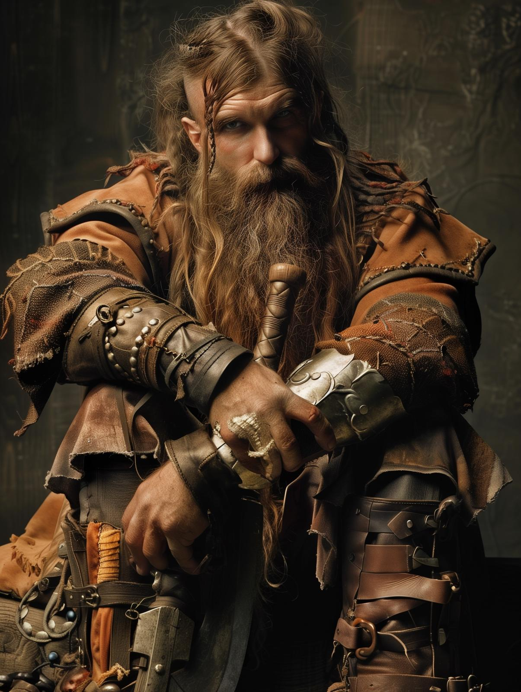

# Bolgrim Ferrystone

- :octicons-info-24:{ .lg .middle } __Biographical Information__

    A [dwarf](<../../species/dwarves.md>) (he/him), of the [Ferrystones](<../../groups/dwarven-clans/ferrystones.md>)  
    { .bio }

    Based in [Rinburg](<../../gazetteer/greater-sembara/sembara/barony-of-aveil/rinburg.md>), the [Barony of Aveil](<../../gazetteer/greater-sembara/sembara/barony-of-aveil/barony-of-aveil.md>), [Sembara](<../../gazetteer/greater-sembara/sembara/sembara.md>)

:octicons-location-24:{ .lg .middle } Currently in [Aslain](<../../gazetteer/greater-sembara/sembara/barony-of-aveil/aslain.md>), the [Barony of Aveil](<../../gazetteer/greater-sembara/sembara/barony-of-aveil/barony-of-aveil.md>), [Sembara](<../../gazetteer/greater-sembara/sembara/sembara.md>)

{align="left"; width="200"}

