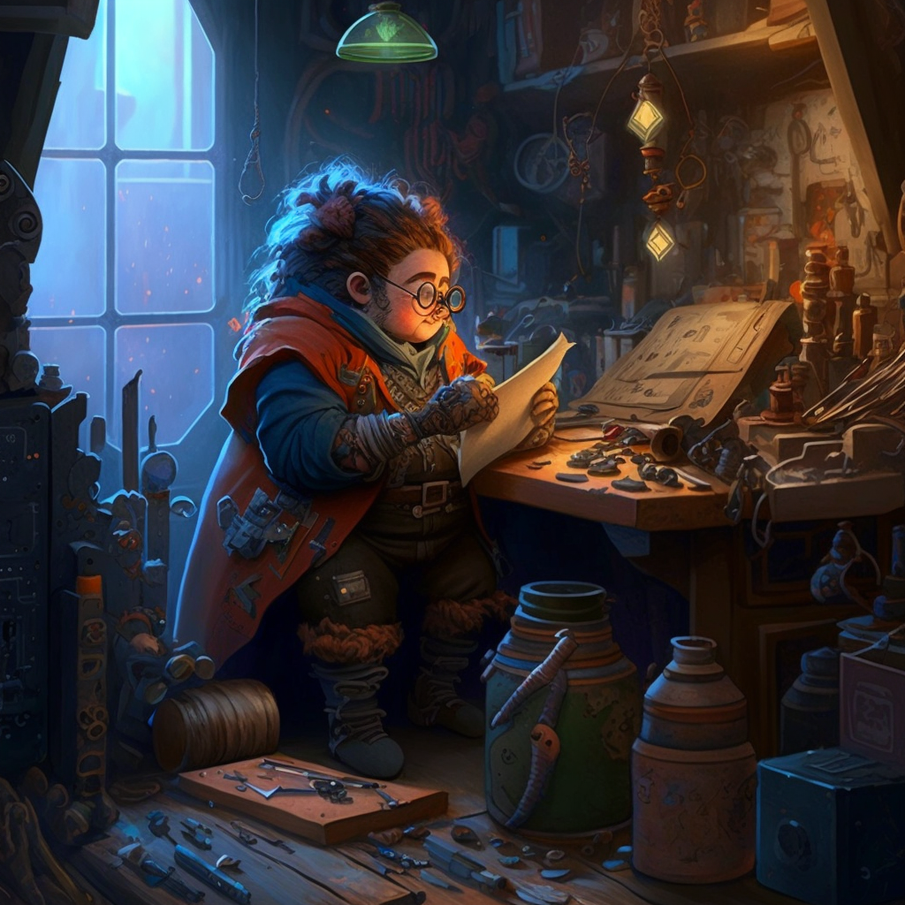

# Brot Starsearcher

- :octicons-info-24:{ .lg .middle } __Biographical Information__

    A [dwarf](<../../species/children-of-the-embodied-gods/dwarves/dwarves.md>) (they/them)  
    Born DR 1579 (170 years old)  
    { .bio }

    Originally from: [Am'khazar](<../../gazetteer/sentinel-range/dwarven-kingdoms/am-khazar.md>), [Labkhan](<../../gazetteer/sentinel-range/sentinel-range.md>)
    Based in [Taviose](<../../gazetteer/greater-sembara/sembara/barony-of-aveil/cleenseau-region/taviose.md>), the [Manor of Cleenseau](<../../gazetteer/greater-sembara/sembara/barony-of-aveil/cleenseau-region/manor-of-cleenseau.md>), the [Barony of Aveil](<../../gazetteer/greater-sembara/sembara/barony-of-aveil/barony-of-aveil.md>)

A dwarven astronomer and tinkerer known for their clever telescope designs who lives in [Taviose](<../../gazetteer/greater-sembara/sembara/barony-of-aveil/cleenseau-region/taviose.md>), a small village on the outskirts of [Cleenseau](<../../gazetteer/greater-sembara/sembara/barony-of-aveil/cleenseau-region/cleenseau/cleenseau.md>). 

  