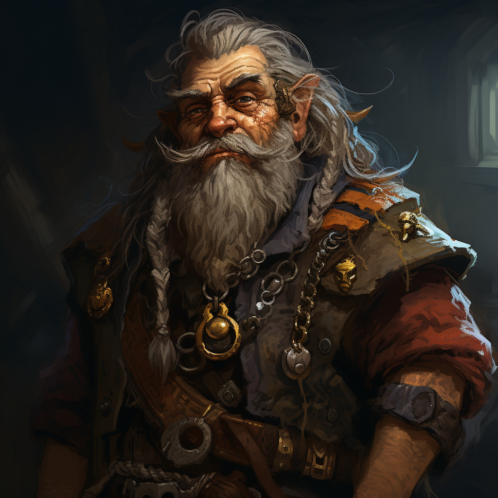

# Faldrak Bronzehammer

- :octicons-info-24:{ .lg .middle } __Biographical Information__

    A [dwarf](<../../species/dwarves.md>) (he/him)  
    Born DR 1516 (233 years old)  
    { .bio }

    Originally from: [Fahnukan](<../../gazetteer/northern-sentinels/fahnukan.md>), [Labkhan](<../../gazetteer/sentinel-range.md>)
    Based in the [Free City of Tollen](<../../gazetteer/greater-sembara/tollen/tollen.md>), the Western Green Sea Region

:octicons-location-24:{ .lg .middle } Currently on [Vindristjarna](<../../things/ships/vindristjarna.md>), in the [Garamjala Desert](<../../gazetteer/drankorian-hinterland/garamjala-plateau/garamjala-desert.md>)

:octicons-location-24:{ .lg .middle } First met by the [Dunmar Fellowship](<../pcs/dunmar-fellowship/dunmar-fellowship.md>) on December 30th, 1748 in the [Free City of Tollen](<../../gazetteer/greater-sembara/tollen/tollen.md>), the Western Green Sea Region  

{align="right"; width="400"}Faldrak Bronzehammer is an aged dwarf runecrafter and tinker, with a touch of Feywild whimsy.
## Overview
Faldrak Bronzehammer, with his eccentric blend of traditional dwarven craftsmanship and fey magic, has become a subject of both admiration and curiosity. Born in [Fahnukan](<../../gazetteer/northern-sentinels/fahnukan.md>), a strange northern dwarven kingdom, his life took an unexpected turn during an accidental sojourn in the [Feywild](<../../cosmology/feywild.md>). Although he emerged with peculiar behaviors, his enhanced craft bearing fey enchantments has left many in awe. 
## Description
Despite his aging exterior and graying, rune-braided beard, Faldrak's eyes sparkle with mischief. His wardrobe—a combination of dwarven armor and fey fabrics—reflects his diverse experiences. A small pouch, perpetually moving, is always by his side. He walks with a cane, which seems to be magical and multipurpose. 
## Events

- In DR 1748, during [Pyravela](<../../gods-and-religions/holidays-and-festivals/pyravela.md>) in [Tollen](<../../gazetteer/greater-sembara/tollen/tollen.md>), Faldrak attended the party hosted by The Dunmar Fellowship on [Vindristjarna](<../../things/ships/vindristjarna.md>), where he met and bonded with Seeker, requesting his aid in journeying to the Edge of Echoes, a mysterious place where the boundaries between the planes (especially between Taelgar and the elemental planes) are thin. 

