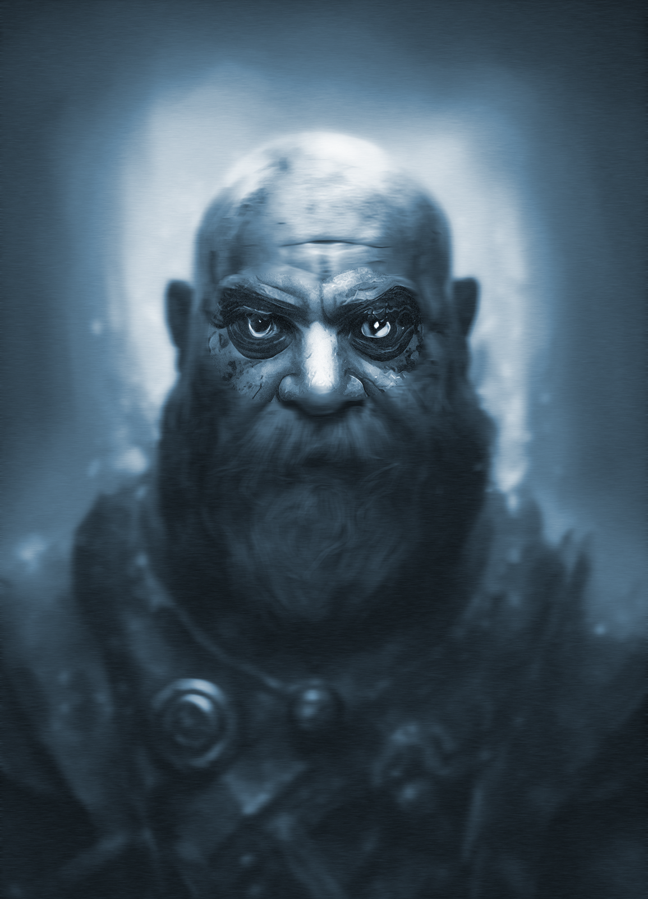

# Hagrim of Morkalan

- :octicons-info-24:{ .lg .middle } __Biographical Information__

    A [dwarf](<../../species/dwarves.md>) (he/him)  
    Died DR 1748  
    { .bio }

    Originally from: [Ardith](<../../gazetteer/central-highlands/dwarven-kingdoms/ardith.md>), [Labkhan](<../../gazetteer/sentinel-range.md>)
    Lived in [Morkalan](<../../gazetteer/extraplanar/shadowfolds/morkalan/morkalan.md>), [Shadowfolds](<../../cosmology/demiplanes-and-echo-realms/shadowfolds.md>), the [Echo Realms](<../../cosmology/demiplanes-and-echo-realms/echo-realms.md>)

{align="right"; width="400"}A dwarf, once known as Hagrim Firebrand, who made a name for himself in the [Great War](<../../events/1500s/great-war.md>), but was unable to forget or move past the horrors he saw in battle against mind flayers and the aberrations of the deep, fighting under the halls of [Ardith](<../../gazetteer/central-highlands/dwarven-kingdoms/ardith.md>). Whether he was broken by battle or his mind was corrupted by those evils, he returned a changed man. 

He reluctantly left his retirement to help lead a group of warriors, including the young solider [Nora Silverspark](<./nora-silverspark.md>), on a rescue mission to find refugees in [Ardith](<../../gazetteer/central-highlands/dwarven-kingdoms/ardith.md>), bringing the [Chalice of the Runepriest](<../../things/artifacts-of-power/chalice-of-the-runepriest.md>) to aid in the question. 

The rescue was somewhat successful, but on the return journey across [Dunmar](<../../gazetteer/greater-dunmar/realms/dunmar/dunmar.md>), the [Dwarves](<../../species/dwarves.md>) encountered the fire giant [Odim Mavdyrson](<../historical-figures/odim-mavdyrson.md>), the son of [Mavdyr](<../historical-figures/mavdyr.md>), who had fought and been defeated by an army of [Dwarves](<../../species/dwarves.md>) and humans outside [Tokra](<../../gazetteer/greater-dunmar/realms/dunmar/central-dunmar/tokra/tokra.md>) in the [Fire War](<../../events/1500s/fire-war.md>). Odim sought revenge for his father's defeat, and drove the [Dwarves](<../../species/dwarves.md>) to take refuge in fortifications constructed  [beneath the ancient Stoneborn Warrior statue](<../../gazetteer/greater-dunmar/dunmari-basin/stoneborn-statue-dungeon.md>) on the plains north of [Tokra](<../../gazetteer/greater-dunmar/realms/dunmar/central-dunmar/tokra/tokra.md>). 

During the ensuing battle, [Hagrim](<./hagrim.md>) broke and turned on [Nora Silverspark](<./nora-silverspark.md>), claiming she was about to betray him. As dwarf fought dwarf, Odim laughed in victory. As Hagrim died, his betrayal and anger, and possibly the corruption in his mind from the aberrations of the [Great War](<../../events/1500s/great-war.md>), created the [Shadowfolds](<../../cosmology/demiplanes-and-echo-realms/shadowfolds.md>) domain of [Morkalan](<../../gazetteer/extraplanar/shadowfolds/morkalan/morkalan.md>) around him, trapping the surviving [Dwarves](<../../species/dwarves.md>) in his nightmare. 

