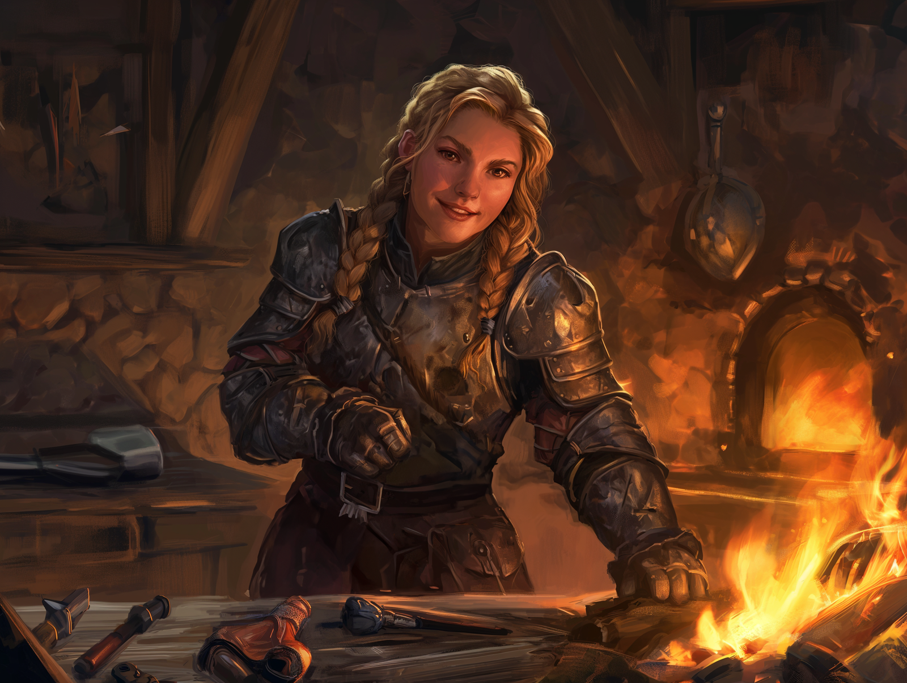

# Kethra Silverspark

- :octicons-info-24:{ .lg .middle } __Biographical Information__

    A [dwarf](<../../species/children-of-the-embodied-gods/dwarves/dwarves.md>) (she/her), of the [Silverspark Clan](<../../groups/dwarven-clans/silversparks.md>)  
    Born DR 1701 (48 years old)  
    { .bio }

    Based in [Tharn Todor](<../../gazetteer/greater-dunmar/realms/nardith/tharn-todor.md>), [Nardith](<../../gazetteer/greater-dunmar/realms/nardith/nardith.md>), the [Yuvanti Mountains](<../../gazetteer/greater-dunmar/yuvanti-mountains.md>)

:octicons-location-24:{ .lg .middle } Currently on [Vindristjarna](<../../things/ships/vindristjarna.md>), owned by the [Dunmar Fellowship](<../pcs/dunmar-fellowship/dunmar-fellowship.md>)

{align="right"; width="400"}Kethra Silverspark, great-grandaughter of [Nora Silverspark](<./nora-silverspark.md>), is a proud dwarven smith and novice adventurer from [Tharn Todor](<../../gazetteer/greater-dunmar/realms/nardith/tharn-todor.md>). 

Inspired by the tales of [Riswynn](<../pcs/dunmar-fellowship/riswynn.md>)'s heroic adventures in returning the [Chalice of the Runepriest](<../../things/artifacts-of-power/chalice-of-the-runepriest.md>) and putting to rest the ghosts of [Nora Silverspark](<./nora-silverspark.md>) and [Hagrim](<./hagrim.md>), among others, she decided to leave home and put herself in Riswynn's service. 