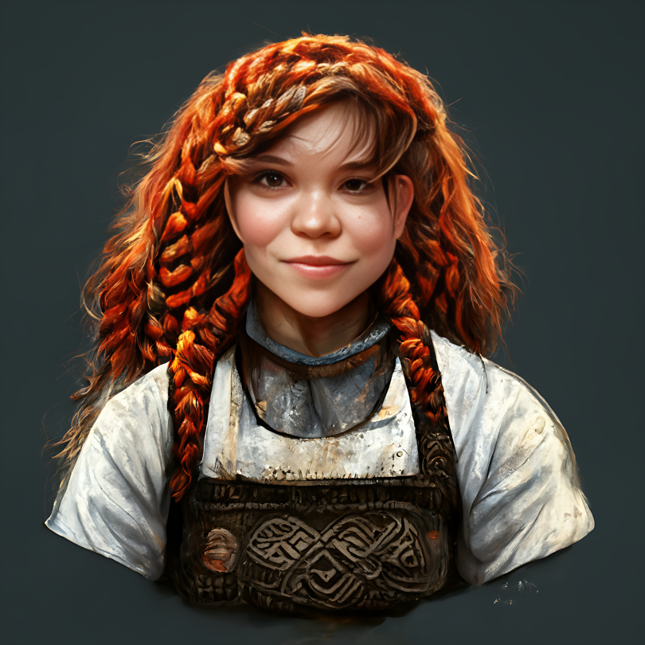

# Vistra Fireforge

- :octicons-info-24:{ .lg .middle } __Biographical Information__

    A [dwarf](<../../species/dwarves.md>) (she/her)  
    Born DR 1589 (160 years old)  
    Proprietor of [The Iron Swan](<../../gazetteer/greater-dunmar/realms/dunmar/central-dunmar/tokra/the-iron-swan.md>) (since DR 1700)  
    { .bio }

    Originally from: [Nardith](<../../gazetteer/greater-dunmar/realms/nardith/nardith.md>), the [Yuvanti Mountains](<../../gazetteer/greater-dunmar/yuvanti-mountains.md>)
    Based in [Tokra](<../../gazetteer/greater-dunmar/realms/dunmar/central-dunmar/tokra/tokra.md>), [Dunmar](<../../gazetteer/greater-dunmar/realms/dunmar/dunmar.md>)

A dwarven blacksmith, trader, innkeep, and adventurer. She is of the Traveler thuhr and originally from [Nardith](<../../gazetteer/greater-dunmar/realms/nardith/nardith.md>). She was born after the [Great War](<../../events/1500s/great-war.md>) and has always been eager to work with humans. She is charming and pleasant enough, but perhaps not that bright and she sometimes makes mistakes in her trades, although she rarely wants to believe it.

In her youth she was a blacksmith and trader in [Ausson's Crossing](<../../gazetteer/upper-istaros/refounded-alliance-of-aurbez/ausson-s-crossing.md>) a crossroads inn south of [Sembara](<../../gazetteer/greater-sembara/sembara/sembara.md>). She is now settled in [Tokra](<../../gazetteer/greater-dunmar/realms/dunmar/central-dunmar/tokra/tokra.md>) where she runs the dwarven inn, [The Iron Swan](<../../gazetteer/greater-dunmar/realms/dunmar/central-dunmar/tokra/the-iron-swan.md>).

