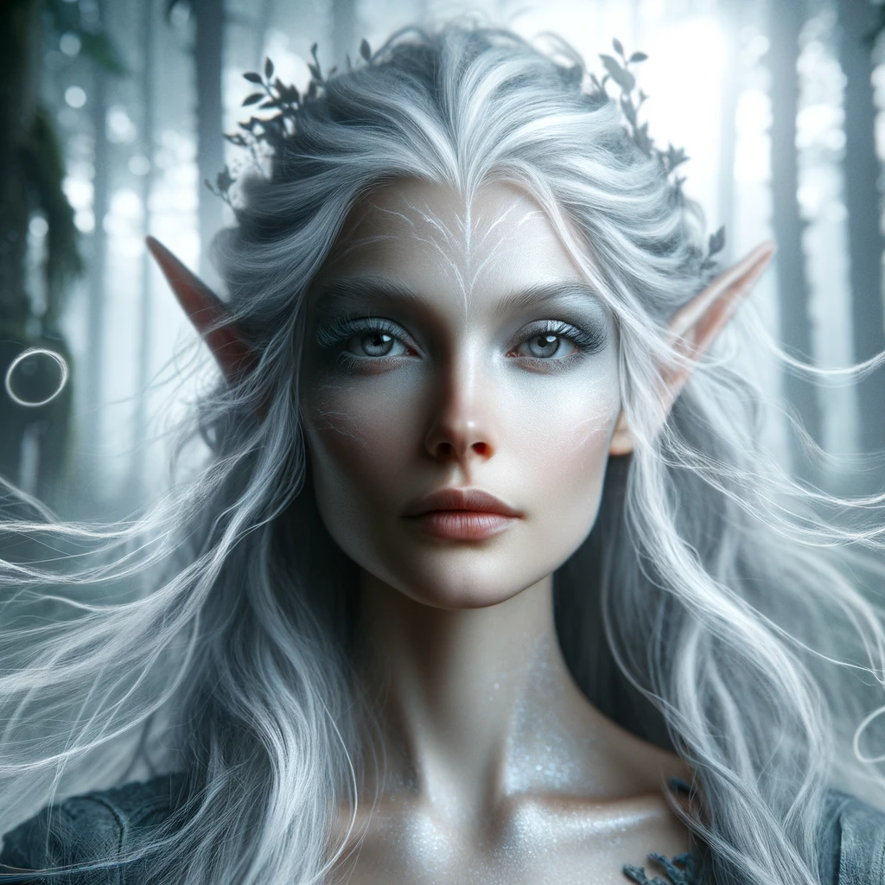
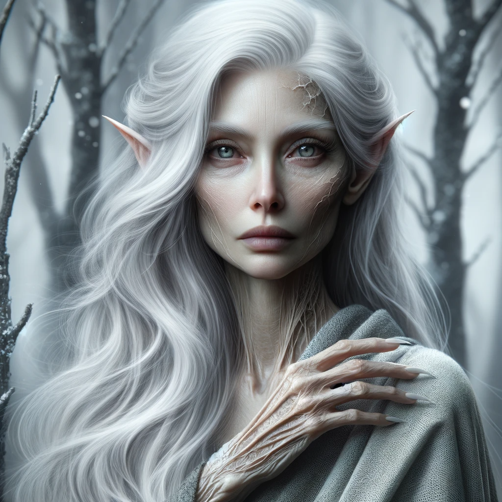

# Arheste
*(AR-hes-teh)*
>[!info]+ Biographical Info  
> An [elf](<../../species/children-of-the-embodied-gods/elves/elves.md>) (she/her), ([ka](<../../species/children-of-the-embodied-gods/elves/the-cycle-of-generations.md>) 31)  
>   
>>   
>>  Visited by the [Dunmar Fellowship](<../pcs/dunmar-fellowship/dunmar-fellowship.md>) on January 16th, 1749 in [Orenlas](<../../gazetteer/istaros-watershed/orenlas/orenlas.md>) 

Arheste is an ancient [elf](<../../species/children-of-the-embodied-gods/elves/elves.md>), with silver hair and piercing eyes, originally born during the days of the Drankorian Empire. He right arm is withered, cramped, and useless, usually worn in a sling, and she looks worn in a way that is very unusual for [elves](<../../species/children-of-the-embodied-gods/elves/elves.md>). She spent much of the first several hundred years of her life in Drankor first as an ally of the emperors, and then, during Apollyon's reign, as a prisoner. After the [First Plague](<../../events/1000s/1059/first-plague.md>), which she survived, albeit damaged and sick, she fled north and eventually settled in [Orenlas](<../../gazetteer/istaros-watershed/orenlas/orenlas.md>). 

## Arheste's Story
*(as told to the [Dunmar Fellowship](<../pcs/dunmar-fellowship/dunmar-fellowship.md>) in DR 1749)*

I was born in Rostaurë (ROS-tow-reh); as the [elves](<../../species/children-of-the-embodied-gods/elves/elves.md>) would translate it, the Forest of Rains. An elvin settlement, maybe 150 miles northeast of [Drankor](<../../history/drankorian-era/drankor.md>), between the river and the bay. The city of my birth was called Estemar (ES-teh-mar), the city of peace, where [humans](<../../species/humans/humans.md>), [elves](<../../species/children-of-the-embodied-gods/elves/elves.md>), and peronar lived together happily. I spent my first [leya](<../../species/children-of-the-embodied-gods/elves/the-cycle-of-generations.md>) at the court of the Drankorian emperors, advising Aglir, and then the twins Pelois and Cekious, who ruled together.
  
It was a good time. There was peace. The land was healthy. Yes, there were battles. I rode to fight with the Drankorian armies against the spreading fire, an alliance of efreeti and fire [elementals](<../../species/children-of-the-divine/elementals.md>) and [giants](<../../species/children-of-the-divine/giants.md>), led by an ancient red dragon that sought to claim the wealth and power of [Drankor](<../../history/drankorian-era/drankor.md>) itself. I saw Pelois and Cekious, the twin emperors, die in dragon fire. But we prevailed, and [Drankor](<../../history/drankorian-era/drankor.md>) did not fall. It was worth saving in those days. During my first [mela](<../../species/children-of-the-embodied-gods/elves/the-cycle-of-generations.md>), I returned to Rostaurë, where my son and my daughter were born. They followed in my footsteps, traveling to [Drankor](<../../history/drankorian-era/drankor.md>) and serving in the court of Imrodel, during their first [leya](<../../species/children-of-the-embodied-gods/elves/the-cycle-of-generations.md>). 

It was then, during the 32nd [leya](<../../species/children-of-the-embodied-gods/elves/the-cycle-of-generations.md>), that things started to go wrong. The Emperor [Helea](<../historical-figures/drankorian-emperors/helea.md>) was assassinated, at the height of her power, by a mysterious group calling themselves the [Omnis Pura](<../../groups/drankorian-societies/omnis-pura.md>), which started a civil war. My son was killed in the fighting in [Drankor](<../../history/drankorian-era/drankor.md>). My daughter fled, hiding with a small group of those she could keep safe in the hills west of the city, keeping a guerrilla resistance alive in Helea's name, calling themselves the Fides Lucaris. She, too, was killed by the [Omnis Pura](<../../groups/drankorian-societies/omnis-pura.md>), in a later battle. 

I protected as many as I could in the Rostaurë, especially the peronar, the [elves](<../../species/children-of-the-embodied-gods/elves/elves.md>) who had lived with [humans](<../../species/humans/humans.md>) since the days of Hkar, and who were seen as particularly insidious and vile by the [Omnis Pura](<../../groups/drankorian-societies/omnis-pura.md>). 

That is when things started to go from bad to worse. During the 33rd meya, when the next generation was singing and dreaming in the great trees of Estemar, the Emperor of [Drankor](<../../history/drankorian-era/drankorian-empire.md>) launched the Dominion Wars, fighting and claiming as much land to the east they could. We defended Rostaurë as best we could through deception and trickery, working with other groups of rebels and dissidents, our allies the Fides Lucaris, who my daughter had fought and died for. We were always protected by [Aldanor](<../../cosmology/gods/embodied-gods/aldanor.md>)'s grace, by the power of his magic that ran through my arm and my blade. 

It was when [Apollyon](<../historical-figures/drankorian-emperors/apollyon.md>), then Emperor, betrayed a great dragon, [Cha'mutte](<../extraplanar-powers/cha-mutte.md>) (who would later fight against for our very survival), that things became dire. [Apollyon](<../historical-figures/drankorian-emperors/apollyon.md>) slaughtered the [orcs](<../../species/children-of-the-embodied-gods/orcs/orcs.md>) and stole the [cloak of rainbows](<../../things/artifacts-of-power/cloak-of-rainbows.md>) from them, which could shut out the gods. With the cloak, [Aldanor](<../../cosmology/gods/embodied-gods/aldanor.md>)'s protection meant nothing. [Apollyon](<../historical-figures/drankorian-emperors/apollyon.md>) sliced through the defenders of Rostaurë; nothing could stop him. Everywhere he strode, the power of [Aldanor](<../../cosmology/gods/embodied-gods/aldanor.md>) was quelled. The tricks that protected us ceased to matter. The city of Estemar was sacked. Rostaurë burned. The elder trees were cut with sleeping children inside.

This disaster was all the worse because it was totally unforeseen by Elmerica. The leya did not come early. The children were not awakened. I think because Elmerica's foresight was blinded by the cloak as well. None of the gods were able to perceive [Apollyon](<../historical-figures/drankorian-emperors/apollyon.md>)'s actions or foresee the danger he brought. I stood against him alone, at the height of my power. He spoke words of death, and I shrugged them off. But every time I raised my sword to summon the power of [Aldanor](<../../cosmology/gods/embodied-gods/aldanor.md>) to my blade and strike with divine force to drive him back, nothing happened. No power came to me. 

I was defeated and taken with a handful of warriors of mine who had survived (except in the peronar, who were all slaughtered) to [Drankor](<../../history/drankorian-era/drankor.md>). I don't know why he kept us alive. We watched as he turned the city into his personal domain. Using a scepter of great power to create adoring, loyal legions, he would round up the peronar and create bigger and bigger spectacles of slaughter. He would summon thousands, tens of thousands of his followers to giant rallies where he would declare himself a god. Perhaps he wanted us to see his newfound power. The growing anger of my people might have been part of his path to godhood. 

On the day he proclaimed himself a god, everything changed. As he spoke the words, calling on the power of the thousands upon thousands of followers under the sway of his power, summoning godhood to himself, a dragon blotted out the sky. [Apollyon](<../historical-figures/drankorian-emperors/apollyon.md>) stood in defiance, but the rending of his soul was felt by all. I saw [Apollyon](<../historical-figures/drankorian-emperors/apollyon.md>), choking and staggering, as I tried to flee the city with the survivors. He was laughing, his arms withered, as he raised a vial of pure blackness to his mouth and cursed [Cha'mutte](<../extraplanar-powers/cha-mutte.md>).

I fled, saving who I could as the city died. My magic burned away, my arm withered, and I could never wield a sword again. I swore to kill [Apollyon](<../historical-figures/drankorian-emperors/apollyon.md>), but first, I had to learn about his fate and the potion he drank—a potion of wild darkness that burns away the soul. [Apollyon](<../historical-figures/drankorian-emperors/apollyon.md>) had made himself [Cha'mutte](<../extraplanar-powers/cha-mutte.md>)'s enemy by declaring himself a god, but whether because of plans long-laid, or some foul purpose of [Cha'mutte](<../extraplanar-powers/cha-mutte.md>)'s, or another cause lost to time, [Apollyon](<../historical-figures/drankorian-emperors/apollyon.md>) did not die that day. He was bound; cursed, some say; imprisoned but not defeated. 

Over the cycles, as [Cha'mutte](<../extraplanar-powers/cha-mutte.md>)'s genocidal intentions towards our people became clearer and clearer, and we sought alliances to defeat him, my mind was on [Apollyon](<../historical-figures/drankorian-emperors/apollyon.md>). I knew [Cha'mutte](<../extraplanar-powers/cha-mutte.md>)'s bindings on [Apollyon](<../historical-figures/drankorian-emperors/apollyon.md>) must hold, or in saving ourselves from [Cha'mutte](<../extraplanar-powers/cha-mutte.md>) we would be creating another great evil. I whispered secrets to [Rai](<../pcs/great-war/rai.md>), knowing he was among the last of Imrodel's line, Imrodel, the last peronar Emperor of [Drankor](<../../history/drankorian-era/drankorian-empire.md>). I whispered secrets to Taelisn, to the Traveler, who fought in the [Great War](<../../events/1500s/great-war.md>) with [Rai](<../pcs/great-war/rai.md>). I whispered and prayed, and as [Cha'mutte](<../extraplanar-powers/cha-mutte.md>) died, miraculously, [Apollyon](<../historical-figures/drankorian-emperors/apollyon.md>) remained bound. I waited, and I hoped for a change with the new cycle, a change that might bring strength back to me, to finish [Apollyon](<../historical-figures/drankorian-emperors/apollyon.md>) once and for all, so I could finally rest.

But as this leya began, something changed. The bindings broke. [Apollyon](<../historical-figures/drankorian-emperors/apollyon.md>) is free, although still weak from long imprisonment, I believe. I do not know if I can survive another ka in my state, but I will do whatever I can, as long as it can be done, to ensure [Apollyon](<../historical-figures/drankorian-emperors/apollyon.md>)'s ultimate defeat. 

*Arheste in an earlier time, before the [First Plague](<../../events/1000s/1059/first-plague.md>).*

*Arheste in [Orenlas](<../../gazetteer/istaros-watershed/orenlas/orenlas.md>).*

