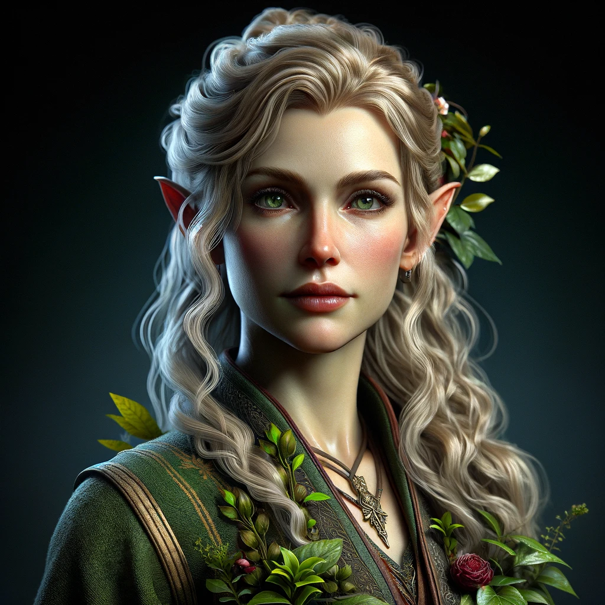

# Ealwen
*(EY-ahl-wen)*
>[!info]+ Biographical Info  
> An [elf](<../../species/children-of-the-embodied-gods/elves/elves.md>) (she/her), ([ka](<../../species/children-of-the-embodied-gods/elves/the-cycle-of-generations.md>) 37)  
>   
>>   
>>  Met by the [Dunmar Fellowship](<../pcs/dunmar-fellowship/dunmar-fellowship.md>) on January 16th, 1748 in [Erelion](<../../gazetteer/istaros-watershed/orenlas/erelion.md>), [Orenlas](<../../gazetteer/istaros-watershed/orenlas/orenlas.md>) 

A gardener, herbalist, and caretaker of [Arheste](<./arheste.md>). 

