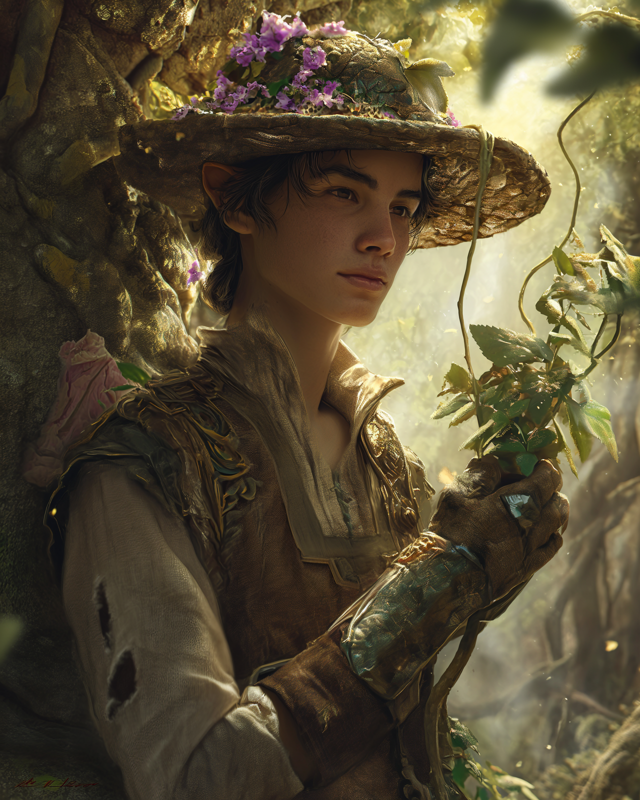

# Égnir

- :octicons-info-24:{ .lg .middle } __Biographical Information__

    An [elf](<../../species/elves.md>) (he/him), ([ka](<../../background/elven-cycle-of-generations.md>) 37)  
    { .bio }

    Originally from: [Orenlas](<../../gazetteer/upper-istaros/orenlas/orenlas.md>)

:octicons-location-24:{ .lg .middle } Currently [Vindristjarna](<../../things/ships/vindristjarna.md>)

{align="right"; width="300"}Egnir is a young elf from [Orenlas](<../../gazetteer/upper-istaros/orenlas/orenlas.md>), venturing forth from the shelter of the elven forests for the first time. He is quiet and reserved, and does not speak much. However, he has an incredible knack for plants, and is an expert gardener. 

Egnir spends most of his time tending to the elven tree growing in the center of the courtyard on [Vindristjarna](<../../things/ships/vindristjarna.md>), and can often be found in the evenings under the starts singing softly in Elvish to the gardens. 