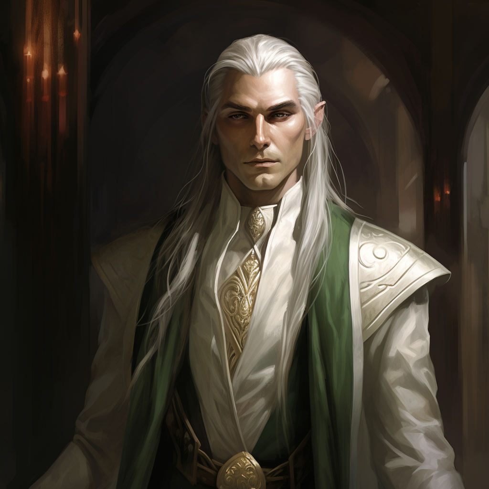

# Melindir
:speaker:{ .middle } *(meh-LIN-deer)*  

- :octicons-info-24:{ .lg .middle } __Biographical Information__

    An [elf](<../../species/children-of-the-embodied-gods/elves/elves.md>) (he/him), ([ka](<../../species/children-of-the-embodied-gods/elves/the-cycle-of-generations.md>) 35)  
    { .bio }

    Originally from: Orenlas
    Based in the Free City of Tollen

:octicons-location-24:{ .lg .middle } Met by the [Dunmar Fellowship](<../pcs/dunmar-fellowship/dunmar-fellowship.md>) on January 2nd, 1749 in the Free City of Tollen  

Melindr is the Ambassador to Tollen for the elven lands of Orenlas.

