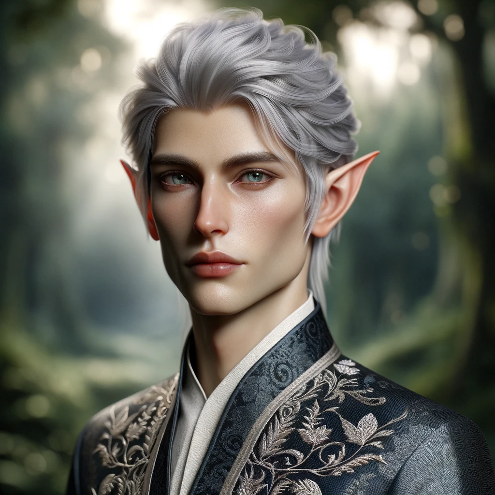

# Vahaiya
:speaker:{ .middle } *(va-HAI-ya)*  

- :octicons-info-24:{ .lg .middle } __Biographical Information__

    An [elf](<../../species/children-of-the-embodied-gods/elves/elves.md>) (they/them), ([ka](<../../species/children-of-the-embodied-gods/elves/the-cycle-of-generations.md>) 36)  
    Born DR 1532 (217 years old)  
    { .bio }

    Originally from: [Ainumarya](<../../gazetteer/chasa-nahadi-watershed/ainumarya.md>)
    Based in [Erelion](<../../gazetteer/istaros-watershed/orenlas/erelion.md>), [Orenlas](<../../gazetteer/istaros-watershed/orenlas/orenlas.md>)

:octicons-location-24:{ .lg .middle } Met by the [Dunmar Fellowship](<../pcs/dunmar-fellowship/dunmar-fellowship.md>) on January 15th, 1748 in [Erelion](<../../gazetteer/istaros-watershed/orenlas/erelion.md>), [Orenlas](<../../gazetteer/istaros-watershed/orenlas/orenlas.md>)  

{align="right"; width="400"}Vahaiya is a warrior, traveler, adventurer, and veteran of the [Great War](<../../events/1500s/great-war.md>). They fought with the Sembaran Army in the in the Battle of Urlich Pass, and survived. After the Great War, they traveled extensively around [Addermarch](<../../gazetteer/greater-sembara/addermarch/addermarch.md>), the [Aurbez Plateau](<../../gazetteer/istaros-watershed/aurbez-plateau.md>), [Maseau](<../../gazetteer/greater-sembara/duchy-of-maseau/duchy-of-maseau.md>), and other Sembaran borderlands for many years. They made a name for themselves in the Sembaran hobgoblin wars.

