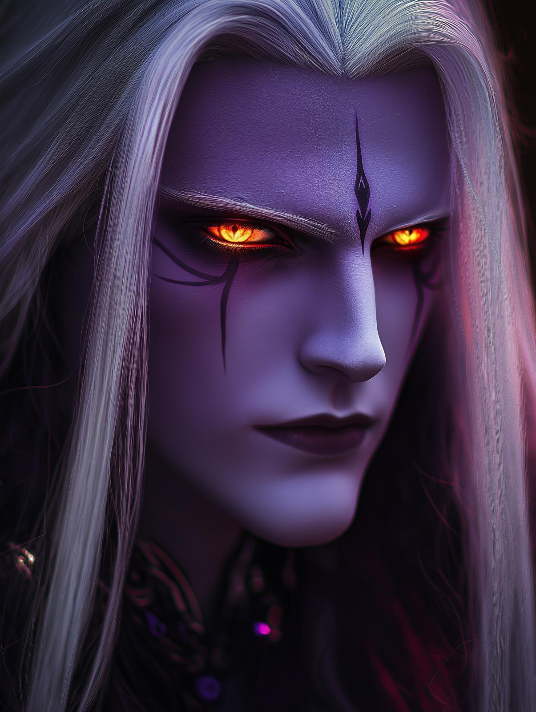

# Lord Serenveil

- :octicons-info-24:{ .lg .middle } __Biographical Information__

    A [fey](<../../../species/extraplanar/fey.md>) ([archfey](<../../../species/extraplanar/fey.md>)) (he/him)  
    { .bio }

{align="right"; width="300"}Lord Serenveil, know as the Prince of the Vesperwind and the Guardian of Twilight's Edge, is a tall, towering figure, with long flowing silver hair, fiery eyes, like fading sunset, and dark skin. He usually dresses in robes that shift colors between deep purples, dusky blues, and silvery grays.

