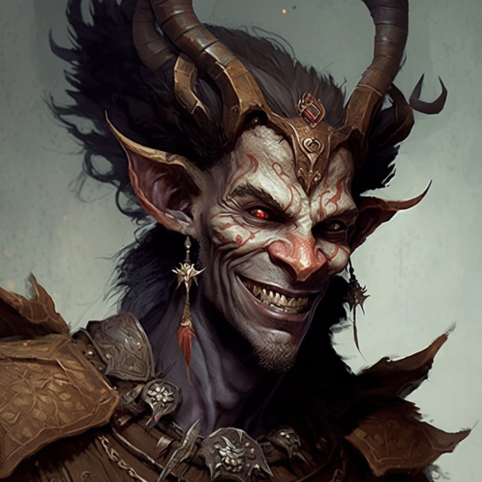

# Lord Umbraeth

- :octicons-info-24:{ .lg .middle } __Biographical Information__

    A [fey](<../../species/children-of-the-divine/fey/fey.md>) (he/him)  
    { .bio }

    Originally from: [Twilight's Grace](<../../cosmology/multiverse/echo-realms/feywild/twilight-s-grace.md>), the [Feywild](<../../cosmology/multiverse/echo-realms/feywild/feywild.md>)
    Based in [Duskmire](<../../cosmology/multiverse/echo-realms/feywild/duskmire.md>), the [Feywild](<../../cosmology/multiverse/echo-realms/feywild/feywild.md>)

Lord Umbraeth, the Gloomshaper, is the ruler of [Duskmire](<../../cosmology/multiverse/echo-realms/feywild/duskmire.md>). 

