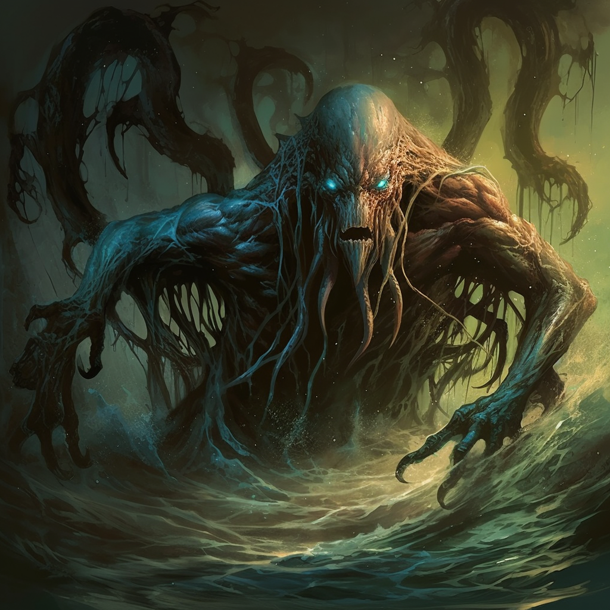

# Mashtu the Corruptor

- :octicons-info-24:{ .lg .middle } __Biographical Information__

    A demon  
    { .bio }

    Based in [Abyss](<../../cosmology/multiverse/spiritual-realms/other-realms/abyss.md>), the [Spiritual Realms](<../../cosmology/multiverse/spiritual-realms/spiritual-realms.md>)

:octicons-location-24:{ .lg .middle } Banished to the [Abyss](<../../cosmology/multiverse/spiritual-realms/other-realms/abyss.md>) by the [Dunmar Fellowship](<../pcs/dunmar-fellowship/dunmar-fellowship.md>) on December 22th, 1748 in [Vetta](<../../gazetteer/western-green-sea/skaerhem/vetta.md>), [Skaerhem](<../../gazetteer/western-green-sea/skaerhem/skaerhem.md>)  

{align="right"; width="420"}A powerful demon of the [Abyss](<../../cosmology/multiverse/spiritual-realms/other-realms/abyss.md>), known for desiring the defiling of sacred waters across the [Green Sea](<../../gazetteer/green-sea.md>).  

Mashtu was the patron of the warlock [Urgall the Black](<../skaer/urgall-the-black.md>), and charged him with a [quest](<../../campaigns/dunmari-frontier/treasure/urgall-s-scroll.md>) to aid in corrupting a number of holy sites across the [Green Sea](<../../gazetteer/green-sea.md>). However, the quest stalled in [Vetta](<../../gazetteer/western-green-sea/skaerhem/vetta.md>), and in DR 1748, Mashtu was [destroyed](<../../campaigns/dunmari-frontier/session-notes/session-81-dufr.md>) by the [Dunmar Fellowship](<../pcs/dunmar-fellowship/dunmar-fellowship.md>), banished back to the [Abyss](<../../cosmology/multiverse/spiritual-realms/other-realms/abyss.md>) to brood. 
